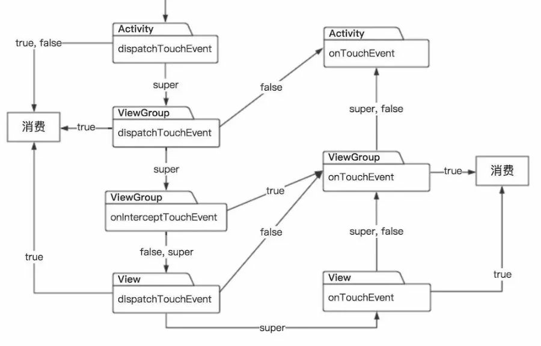

当我们的手指触碰到屏幕，事件是按照Activity->ViewGroup->View这样的流程到达最终响应触摸事件的View的。
而在事件分发过程中，涉及到三个最重要的方法：dispatchTouchEvent()、onInterceptTouchEvent()、onTouchEvent。
我们的手指触摸到屏幕的时候，会触发一个Action_Down类型的事件，当前页面的Activity会首先做出相应，也就是说会走到Activity
的dispatchTouchEvent()方法内。在这个方法内部有下面两个逻辑：
调用getWindow.superDispatchTouchEvent()。如果上一步返回true，则直接返回true；否则return自己的onTouchEvent()。
显然，当getWindow.superDispatchTouchEvent()返回true，表示当前事件已经被消费掉，无需调用onTouchEvent；否则代表事件
并没有被处理，因此需要调用Activity的onTouchEvent进行处理。我们都知道，getWindow()返回的是PhoneWindow，因此这句代码
本质上调用了PhoneWindow中的superDispatchTouchEvent()。而后者实际上调用了mDecor.superDispatchTouchEvent(event)。
这个mDecor也就是DecorView，它是FrameLayout的一个子类。在DecorView中的superDispatchTouchEvent(event)中调用的是
super.dispatchTouchEvent()。因此，本质上调用的是ViewGroup的dispatchTouchEvent()。
到这里，事件已经从Activity传递到ViewGroup了。接下来我们分析ViewGroup。在ViewGroup的dispatchTouchEvent()中逻辑大致如下：
通过onInterceptTouchEvent()判断当前ViewGroup是否拦截，默认的ViewGroup都是不拦截的；
如果拦截，则return自己的onTouchEvent()；如果不拦截，则根据child.dispatchTouchEvent()的返回值判断。如果返回true，则return true；
否则return自身的onTouchEvent()，在这里实现了未处理事件的向上传递。通常情况下，ViewGroup的onInterceptTouchEvent()都返回false，
表示不拦截。这里需要注意的是事件序列，比如Down事件、Move事件…Up事件，从Down到Up是一个完整的事件序列，对应着手指从按下到抬起这一系列事件，
如果ViewGroup拦截了Down事件，那么后续事件都会交给这个ViewGroup的onTouchEvent。如果ViewGroup拦截的不是Down事件，那么会给之前处理
这个Down事件的View发送一个Action_Cancel类型的事件，通知子View这个后续的事件序列已经被ViewGroup接管了，子View恢复之前的状态即可。
这里举一个常见的例子：在一个 Recyclerview 中有很多的 Button，我们首先按下了一个 button，然后滑动一段距离再松开，这时候 Recyclerview 
会跟着滑动，并不会触发这个 button 的点击事件。这个例子中，当我们按下 button 时，这个 button 接收到了 Action_Down 事件，正常情况下后续
的事件序列应该由这个 button处理。但我们滑动了一段距离，这时  Recyclerview 察觉到这是一个滑动操作，拦截了这个事件序列，走了自身的 
onTouchEvent()方法，反映在屏幕上就是列表的滑动。而这时 button 仍然处于按下的状态，所以在拦截的时候需要发送一个 Action_Cancel 来通知 
button 恢复之前状态。
事件分发最终会走到View的dispatchTouchEvent()中。在View的dispatchTouchEvent()中没有onInterceptTouchEvent()，这里很容易理解，
View没有child，也就不存在拦截。View的dispatchTouchEvent()直接return了自己的onTouchEvent()。如果onTouchEvent()返回true代表事件被消费，
否则未消费的事件会向上传递，直到有View处理了事件或一直没有消费，最终回到Activity的onTouchEvent()终止。有时候会有人混淆onTouchEvent和onTouch。
首先，这两个方法都在View的dispatchTouchEvent()中：
如果touchListener不为null，并且这个View是enable的，而且onTouch返回true，都满足时直接return true，走不到onTouchEvent()方法。否则，
就会触发onTouchEvent()。因此onTouch优先于onTouchEvent获得事件处理权。

