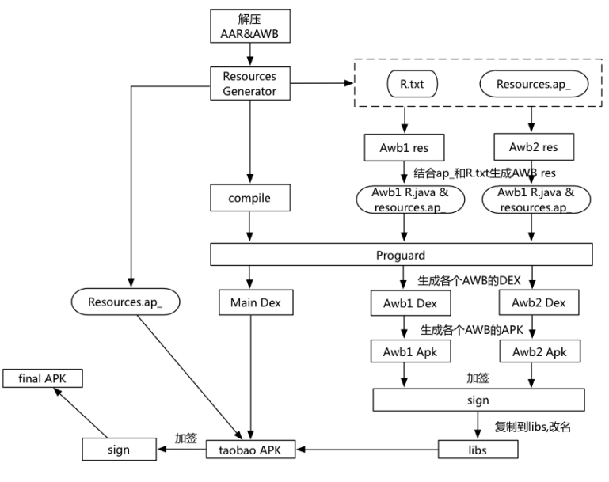

# atlas

atlas组件打包过程：

上面的图中，其实左边这一部分是一个标准的APK的构建过程，包括处理，编译，到签名的过程。

我们这个不同的地方是多了Awb需要特殊处理：

1）其中Awb的资源根据宿主的resource.ap_和包内资源构建，R文件由Bundle R资源和宿主R资源合并而来；

2）然后我们对Aapt进行了修改，对每个awb分配不同的packageId；

3）然后进行统一混淆，生产各个AWB的Dex；

4）打包为APK，签名之后复制到libs，改名为so文件；

5）然后合并到taobao APK.

这就是我们组件化的整个过程。所以解压缩插件化后的文件，可以看到libs下面有很多so文件。

参考： 
[atlas-github](https://github.com/alibaba/atlas) 
[atlas官网](http://atlas.taobao.org/) 
[Atlas：手淘Native容器化框架和思考](http://www.infoq.com/cn/articles/shoutao-atlas)