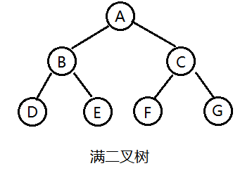
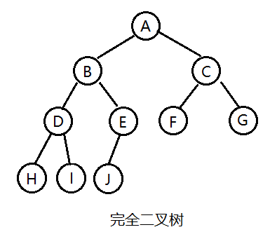
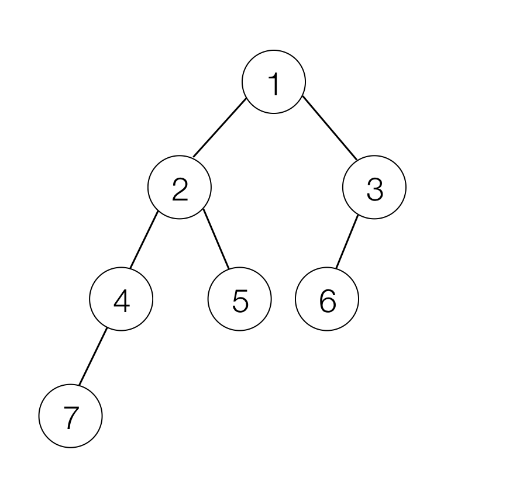

### 1 二叉树

二叉树（Binary Tree）是有限个节点的集合，这个集合可以是空集，也可以是一个根节点和两颗不相交的子二叉树组成的集合，其中一颗树叫根的左子树，另一颗树叫右子树。所以二叉树是一个递归地概念。

##### 1.1 满二叉树（Full Binary Tree）

一棵满二叉树就是高度为k，且拥有(2^k)-1个节点的二叉树，一棵满二叉树每个节点，要么都有两棵子树，要么都没有子树；而且每一层所有的节点之间必须要么都有两棵子树，要么都没子树。



##### 1.2 完全二叉树（Complete Binary Tree）

完全二叉树是一颗特殊的二叉树，它遵循以下规则：<br>
假设完全二叉树高度为k，则完全二叉树需要符合以下两点：<br>
1）所有叶子节点都出现在k层或k-1层，并且从1~k-1层必须达到最大节点数。<br>
2）第k层可以是不满的，但是第k层的所有节点必须集中在最左边。



### 2 二叉树实现

二叉树节点：

```
public class BinaryTreeNode {

    public int value;

    public BinaryTreeNode left;

    public BinaryTreeNode right;

    public BinaryTreeNode(int value) {
        this.value = value;
    }
}
```


二叉树：

```
public class BinaryTree {

    private BinaryTreeNode root;

    public BinaryTree(BinaryTreeNode root) {
        this.root = root;
    }

    /**
     * 二叉树是否为空
     */
    public boolean isEmpty() {
        return root == null;
    }

    /**
     * 清空二叉树
     */
    public void clear() {
        clear(root);
    }

    private void clear(BinaryTreeNode node) {
        if (node != null) {
            clear(node.left);
            clear(node.right);
            node = null;
        }
    }

    private void print(BinaryTreeNode node) {
        if (node == null) {
            throw new NullPointerException("Invalid node param!");
        }
        System.out.println("node_" + node.value);
    }
}
```


##### 2.1 计算二叉树高度

```
	/**
	 * 二叉树高度
	 */
	public int getHeight() {
	    return getHeight(root);
	}
	
	// 递归遍历左右子树
	private int getHeight(BinaryTreeNode node) {
	    if (node == null) {
	        return 0;
	    }
	    int l = getHeight(node.left);
	    int r = getHeight(node.right);
	    return l > r? l+1: r+1;
	}
```

##### 2.2 计算二叉树节点个数

```
    /**
     * 二叉树节点数
     */
    public int getSize() {
        return getSize(root);
    }

    private int getSize(BinaryTreeNode node) {
        if (node == null) {
            return 0;
        }
        return 1 + getSize(node.left) + getSize(node.right);
    }
```

##### 2.3 获取当前节点的父节点

```
	/**
     * 获取当前节点的父节点
     */
    public BinaryTreeNode getParentNode(BinaryTreeNode target) {
        if (target == root) {
            return null;
        }
        return getParentNodeImpl(root, target);
    }

    private BinaryTreeNode getParentNodeImpl(BinaryTreeNode cur, BinaryTreeNode target) {
        if (cur == null) {
            return null;
        }
        if (cur.left == target || cur.right == target) {
            return cur;
        }

        BinaryTreeNode left = getParentNodeImpl(cur.left, target);
        if (left != null) {
            return left;
        }

        return getParentNodeImpl(cur.right, target);
    }
```

##### 2.4 前序、中序、后序遍历

```

    /**
     * 前序遍历： 先遍历根，再遍历左子树，最后遍历右子树
     */
    public void preOrder() {
        preOrder(root);
    }

    private void preOrder(BinaryTreeNode node) {
        if (node != null) {
            print(node);
            preOrder(node.left);
            preOrder(node.right);
        }
    }

    /**
     * 中序遍历： 先遍历左子树，再遍历根，最后遍历右子树
     */
    public void inOrder() {
        inOrder(root);
    }

    private void inOrder(BinaryTreeNode node) {
        if (node != null) {
            inOrder(node.left);
            print(node);
            inOrder(node.right);
        }
    }

    /**
     * 后序遍历： 先遍历左子树，再遍历右子树，最后遍历根
     */
    public void postOrder() {
        postOrder(root);
    }

    private void postOrder(BinaryTreeNode node) {
        if (node != null) {
            postOrder(node.left);
            postOrder(node.right);
            print(node);
        }
    }
```


### 3 测试用例
构建如下二叉树：



测试类：

```
public class BinaryTreeMain {

    public static void main(String[] args) {
    	// 构建二叉树
        BinaryTreeNode root = new BinaryTreeNode(1);
        BinaryTreeNode node2 = new BinaryTreeNode(2);
        BinaryTreeNode node3 = new BinaryTreeNode(3);
        BinaryTreeNode node4 = new BinaryTreeNode(4);
        BinaryTreeNode node5 = new BinaryTreeNode(5);
        BinaryTreeNode node6 = new BinaryTreeNode(6);
        BinaryTreeNode node7 = new BinaryTreeNode(7);
        root.left = node2;
        root.right = node3;
        node2.left = node4;
        node2.right = node5;
        node3.left = node6;
        node4.left = node7;
        BinaryTree tree = new BinaryTree(root);
        
        print("height:"+tree.getHeight()); // 二叉树高度
        print("size:"+tree.getSize()); // 二叉树节点数

        BinaryTreeNode parent = tree.getParentNode(node6);
        print("parent of node6 is : "+ (parent != null? "node" + parent.value: "null"));

        print("Start pre order:");
        tree.preOrder();
        
        print("Start in order:");
        tree.inOrder();
        
        print("Start post order:");
        tree.postOrder();
    }

    private static void print(String msg) {
        System.out.println(msg);
    }
}
```
