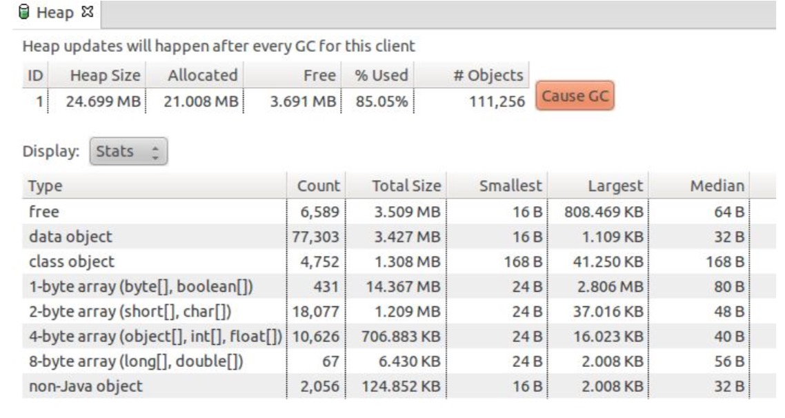
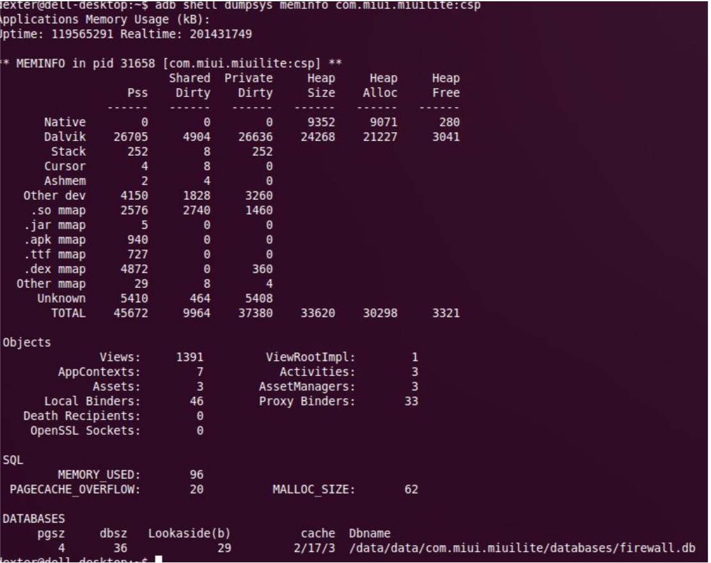
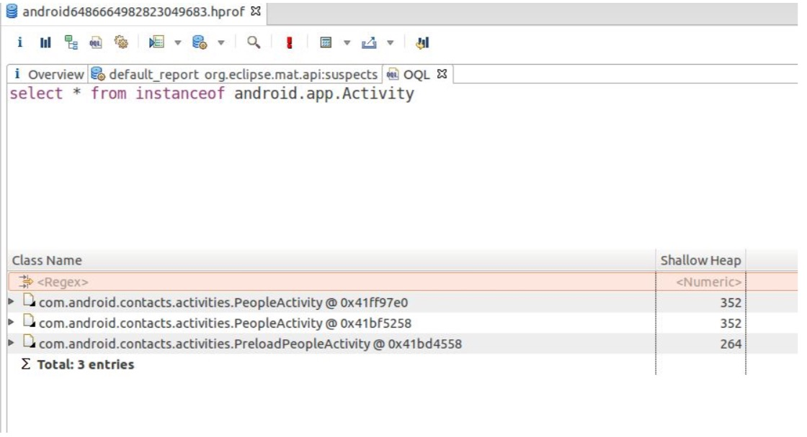
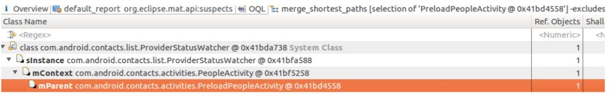
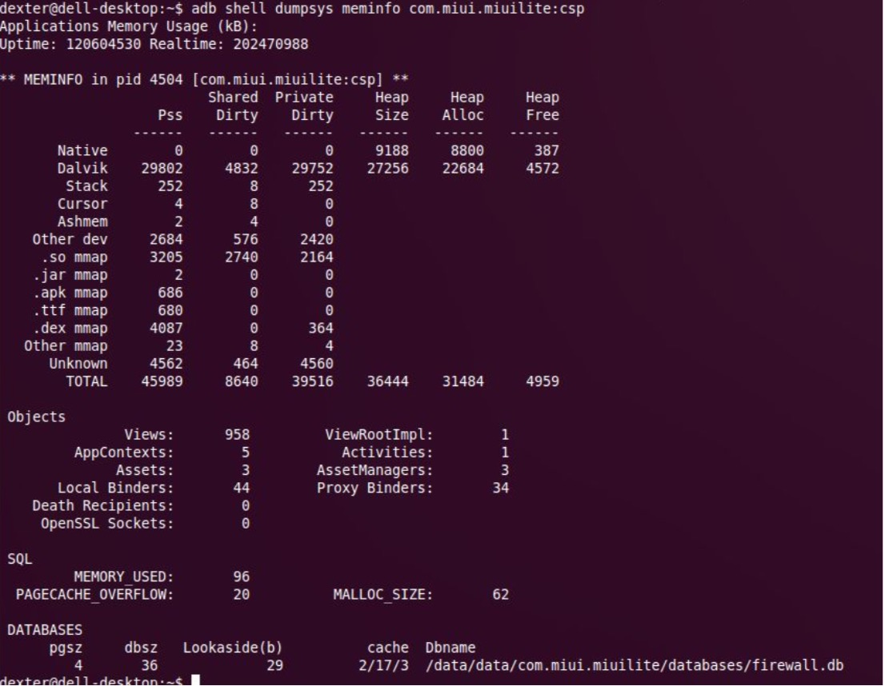

[ADT插件](http://developer.android.com/sdk/installing/installing-adt.html)

发现 Activity 泄露的三种种方法:

1. 通过StrictMode模式来发现，如果有Activity泄露直接会闪退，不过这种方法有时过于严格了，会把一 些延迟释放 Activity 的场景也算在内;
开启 StrictMode 需要在 BaseActicity.onCreate() 加上:StrictMode.setVmPolicy(new StrictMode.VmPolicy.Builder().detectAll().penaltyLog().penaltyDeath().build());
2. 使用LeakCanary

3. 通过 adb shell dumpsys meminfo 和 ddms 来确定泄露源，这种方法更精确，一般用于第一种方法发现 具体的可疑 Activity 泄露，然后再通过这种方法再精确定位问题。

举个例子说一下方法 3 的具体流程：

例子的场景:由于小米系统首次启动联系人(PeopleActivity)的速度特别慢，所以我们采用了预加载的技 术，在 Application.onCreate 启动了 PreloadPeopleActivity，之后用户在进入 PeopleActivity 时， PreloadPeopleActivity 会自动 finish。

1. 点击联系人 PeopleActivity，然后打开 ddms , 找到对应的进程 com.miui.miuilite:csp，进入进程对应的 heap 视图，然后点击右边的"Cause GC"来手动触发进程的 gc 。


2. adb shell dumpsys meminfo com.miui.miuilite:csp



可以看到 Activities: 3

说明当前 csp 进程有 3 个 Activity 实例，而我们只启动了 PeopleActivity，之前的 PreloadActivity 也已经
finish，所以这里肯定有 Activity 泄露!

3. 回到 ddms, Dump HPROF file，然后点击 OOL，输入 select * from instanceof android.app.Activity，点 击右上角红色的执行按钮得到结果:



可以看到 PreloadActivity 没有释放，PeopleActivity 也多了一份实例，先来看看 PreloadPeopleActivity 为什 么泄露。

4. 右键点击 PreloadPeopleActivity --> Merge Shortest Path to GC Roots --> exclude weak/soft references



泄露的根源:ProviderStatusWatcher 的 mContext 对象抓住了 PreloadPeopleActivity

代码修改:

```java

if(mIsPreload) { 
    // 预加载时
     mProviderStatusWatcher.setContext(getApplicationContext());
}
```

5. 验证结果，修改后重新进入联系人后


可以看到这次 Activities 显示为 1 个，说明已经没有泄露了。