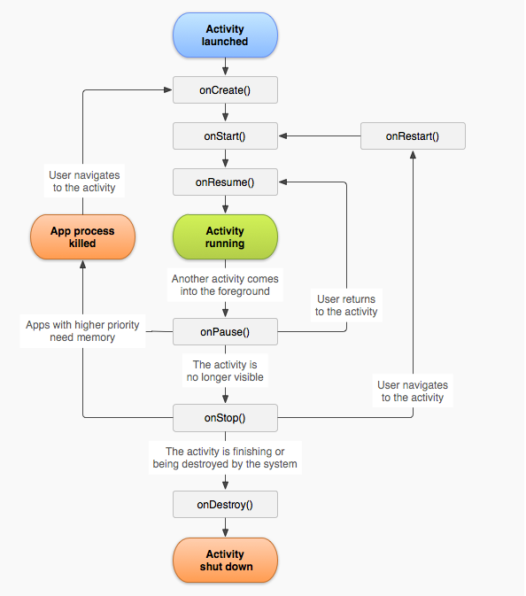

#### Activity的生命周期

onCreate: 表示Activity正在被创建

onRestart:表示Activity正在重新启动

onStart：表示Activity正在被启动

onResume：表示Activity已经可见了

onPause：表示Activity正在停止

onStop：表示Activity正在停止

onDestroy：表示Activity即将被销毁

注意：当用户打开新的Activity或者切换到桌面的时候，当前Activity的回调如下：onPause -> onStop。但是当新Activity采用了透明主题，那么当前Activity则不会回调onStop。

//透明主题 代码

从整个生命周期来说，onCreate和onDestroy是配对的，分别标识着Activity的创建和销毁。
从Activity的可见性来说，onStart和onStop是配对的。
从Activity是否在前台来说，onResume和onPause是配对的。

问题：假设当前Activity为A，如果这是用户打开一个新Activity B,那么B的onResume和A的onPause哪个会先执行？

旧Activity的onPause要先调用，然后新Activity才启动。

//代码以及源码分析

- AlertDialog，Toast对Activity生命周期的影响
- 前台切换到后台，然后再回到前台，Activity生命周期回调方法。弹出Dialog，生命值周期回调方法

#### Activity的启动模式

standard：标准模式

每次启动都会创建一个新的实例。

该模式下，新启动的Activity会放在启动它的Activity所在的栈中。所以使用Application Context启动Activity会报错，因为非Activity的Context并没有所谓的任务栈。解决此问题的方法是待启动Activity指定``FLAG_ACTIVITY_NEW_TASK``标记位，这样，会先新建一个任务栈，再把待启动的Activity放到新的栈中。

singleTop: 栈顶复用

只有待启动Activity在栈顶时，才会复用。

即待启动的Activity位于栈顶时，这种启动方式下不会创建新的，而是复用栈顶的那个Activity，并且调用它的onNewIntent()。如果待启动Activity不在栈顶，就创建个新的放在栈顶。
    示例，ABCD情况下，A在栈底，D在栈顶。1）启动D，结果是ABCD；2）启动B，结果是ABCDB。

singleTask: 栈内复用

同一个栈内，如果有待启动的Activity，则复用该Activity。

复用时，和singleTop一样，回调onNewIntent()。

该模式具有clearTop作用，即待启动Activity上调到栈顶时，位于它前面的Activity会被清除。
    具体解释，具有singleTask模式的Activity A被启动时，系统会首先找是否存在A想要的任务栈，如果没有，就新建个任务栈，并创建A的实例放到栈中。如果存在A需要的任务栈，就看栈中有没有A的实例。如果有，把A调到栈顶，并调用它的onNewIntent()，如果没有，就新建A的实例压入栈中。
    示例，ABCD情况下，A在栈底，D在栈顶。启动B，结果是AB。

singleInstance: 单例模式

和singleTask一样，但是加强了一点，就是该模式下的Activity会独占一个栈。
