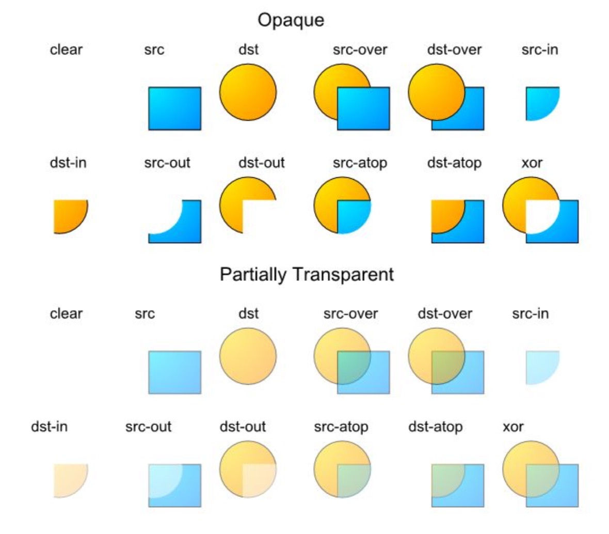
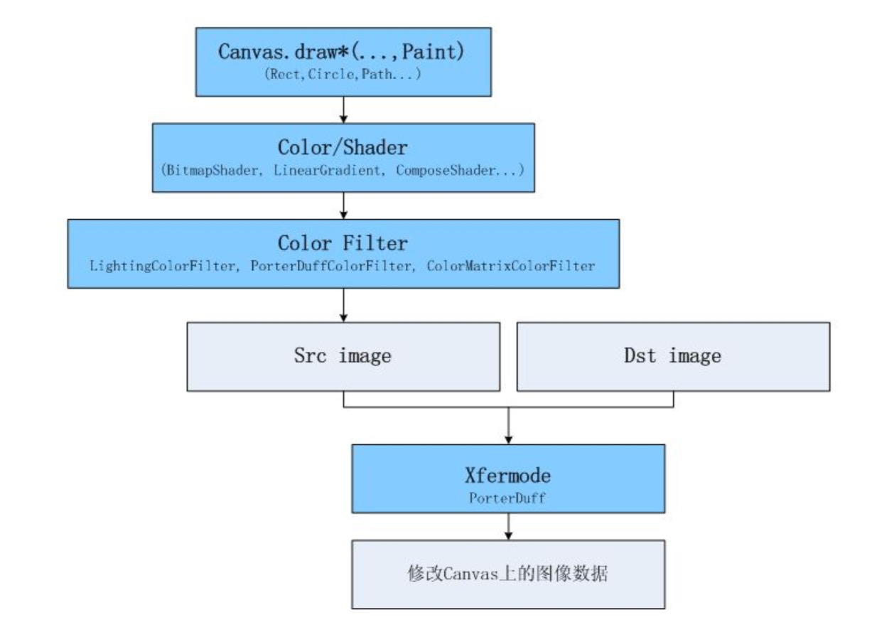

## 动画基础

* 本质
每帧绘制不同的内容

* 基本过程
开始动画后，调用 View 的 invalidate 触发重绘。重绘后检查动画是否停止，若未停止则继续调用 invalidate 触发下一帧(下一次重绘)，直到动画结束。

重绘时 View 的 draw 方法会被调用，根据动画的进行绘制不同的内容，如某个被绘制元素的大小变化、角 度旋转、透明度变化等，这样即会产生动画。

动画的推进过程一般都会有一个变化量，这个变量会被用到 draw 方法内元素的绘制。一般的变量都是时 间，也可以是手指移动、传感器等任何其他的变量。

* Android中的动画支持

[Animation:](http://developer.android.com/reference/android/view/animation/Animation.html)早期实现的让 View 整体做动画的类。能让 View 做 Matrix(移动、缩放、旋转、3D 旋转)和 Alpha(透明)的动画。
[Animator:](http://developer.android.com/reference/android/animation/Animator.html)有硬件加速后为做动画实现的类。能方便的让 View 整体做动画;也可以只产生随时间变化的变 量，用来在 onDraw 里做绘图级的动画。比 Animation 灵活很多。
[AnimationDrawable](http://developer.android.com/reference/android/graphics/drawable/AnimationDrawable.html)图片逐帧动画。主要用来播放提前制作好的动画。

* 在哪个级别做动画

让整个 View 做动画(比如整个 View 平移、旋转等)很简单方便，一般调用几行代码就行。我把它称作 View 级的动画。

在 View 的 draw/onDraw 里通过 Canvas 来绘制时做动画更灵活，更精细，能力更强大。我把它称作绘图 级的动画。(View 级的动画本质上也是这么做的，只是 Android 系统帮我们做了大部分工作)

* 绘图级的动画
下面来一段绘图级动画的典型实现:

```java
class MyView extends View { 
    void startAnimator() {
        ValueAnimator animator = ValueAnimator.ofFloat(1f, 0f);
        animator.start(); 
        invalidate();
        }

protected void onDraw(Canvas canvas) {
    if (animator.isRunning()) {
        float ratio = (Float)animator.getAnimatedValue(); 
        canvas.rotate(ratio*360); 
        canvas.drawBitmap(bitmap, 0, 0, null);
        invalidate(); 
        }
        ... 
    }
}
```

有了不断变化的 ratio 变量，绘图级动画就可以大展身手了。 绘图级动画的强大能力来自绘图 API 的强大能力，下面主要讲绘图 API。

## 绘图API
* Matrix

[Canvas](http://developer.android.com/reference/android/graphics/Canvas.html).[translate,scale,rotate,skew]方法

[Matrix](http://developer.android.com/reference/android/graphics/Matrix.html).set/pre/post[translate,scale,rotate,skew]方法

平移、缩放、旋转、斜切

从使用 API 的角度来看，我们通过调用 Canvas.translate 等方法，可以使后续在此 Canvas 上绘制操作的 绘制区域变化，如 translate(5,0)，则后续所有绘制操作的绘制区域都会向右移动 5 个像素。

原理:Canvas 里有一个 Matrix，Canvas 上的这几个调用都会最终调用到 Matrix.pre*。这个 Matrix 保存整 个变换过程。当有 Canvas.draw 时，要绘制的点都会经过 Matrix.mapPoints 方法做一个映射。于是产生我 们期望的变换效果。(事实上映射的时候只需要映射关键点，其他的是插值来的)

关于 Matrix 的更多信息

set/pre/post 的区别:set 是设置，冲掉以前的数据。pre 是前乘，post 是后乘，根本上讲就是生效顺 序不同。具体表现效果可在网上搜索资料。

setPolyToPoly:与 mapPoints 方法相反，mapPoints 是通过矩阵把原始点映射为目标点。 
setPolyToPoly 是输入原始点和映射后的目标点，计算出这个矩阵。

[Camera](http://developer.android.com/reference/android/graphics/Camera.html):有透视效果的 3D 旋转。Camera 是一个生成 Matrix 的工具类。可用来生成有透视效果的 3D 旋转。

Canvas.draw*方法

Canvas.draw-Point/s
Canvas.draw-Line/s 
Canvas.draw-Rect,RoundRect,Circle,Oval,Arc,Path 
Canvas.draw-Text 
Canvas.draw-Bitmap,BitmapMesh 
Canvas.draw-Color,Paint

这些方法都表示绘制一个区域。绘制的区域中究竟填充什么颜色，由 Paint 决定。

Color,Paint,Bitmap,BitmapMesh 这几个则除了指定绘制区域外，还指定了填充内容。

Path 功能比较强大，可自行组织成任何形状，还可以用贝塞尔曲线。

这些方法基本上都很好理解，从名字上即可看出其功能。这里重点提一下 drawBitmapMesh。

drawBitmapMesh 是输入一个网格模型，绘制出的图片内容将依据这个网格来扭曲。可以想像成把图片画
在一块有弹性的布上，当我们把布的某些区域扯动的时候，会形成画面扭曲效果。

示例:假设有个 30x30 大小的图片，我们建立这样的网格输入:

0,0 | 15,0 | 30,0 
- | :-: | :-: 
0,15 | 15,15 | 30,15 
0,30 | 15,30| 30,30 

则图片会原样输出，没有任何扭曲。

如果我们建立这样的网格输入:

0,0 | 15,12 | 30,0 
- | :-: | :-: 
0,15 | 15,15 | 30,15 
0,30 | 15,30| 30,30 

则原本[15,0]的点会被绘制到[15,12]的位置上去。图片绘制出来后，上面部分会缺一块，形成用手把图片从 上边中间位置往下拉的扭曲效果。但很锐利，上面缺的一块是个三角形而不会是半圆型，通常我们希望的 是半圆型，这就需要我们把这个网格建得密一些。

* Alpha 通道

每个 Color 里可以有四个通道 ARGB，其中 RGB 是红绿蓝，A 即 Alpha 通道，它通常的作用是用来作为此 颜色的透明度。

因为我们的显示屏是没法透明的，因此最终显示在屏幕上的颜色里可以认为没有 Alpha 通道。Alpha 通道 主要在两个图像混合的时候生效。

默认情况下，当一个颜色绘制到 Canvas 上时的混合模式是这样计算的:(RGB 通道) 最终颜色 = 绘制的颜 色 + (1 - 绘制颜色的透明度) × Canvas 上的原有颜色。

> 注意:
1. 这里我们一般把每个通道的取值从 0 到 255 映射到 0 到 1 的浮点数表示。
2. 这里等式右边的“绘制的颜色"、“Canvas 上的原有颜色”都是经过预乘了自己的 Alpha 通道的值。如 绘制颜色:0x88ffffff，那么参与运算时的每个颜色通道的值不是 1.0，而是(1.0 * 0.53125 = 0.53125)。

使用这种方式的混合，就会造成后绘制的内容以半透明的方式叠在上面的视觉效果。

其实还可以有不同的混合模式供我们选择，用 Paint.setXfermode，指定不同的 [PorterDuff.Mode](http://developer.android.com/intl/zh-CN/reference/android/graphics/PorterDuff.Mode.html)。

下表是各个 PorterDuff 模式的混合计算公式:(D 指原本在 Canvas 上的内容 dst，S 指绘制输入的内容 src，a 指 alpha 通道，c 指 RGB 各个通道)

ADD | Saturate(S + D) 
- | :-: | 
CLEAR | [0, 0]
DARKEN | [Sa + Da - Sa*Da, Sc*(1 - Da) + Dc*(1 - Sa) + min(Sc, Dc)]
DST | [Da, Dc]
DST_ATOP | [Sa,Sa*Dc+Sc*(1-Da)]
DST_IN | [Sa * Da, Sa * Dc]
DST_OUT | [Da * (1 - Sa), Dc * (1 - Sa)]
DST_OVER | [Sa + (1 - Sa)*Da, Rc = Dc + (1 - Da)*Sc]
LIGHTEN | [Sa + Da - Sa*Da, Sc*(1 - Da) + Dc*(1 - Sa) + max(Sc, Dc)]
MULTIPLY | [Sa * Da, Sc * Dc]
SCREEN | [Sa + Da - Sa * Da, Sc + Dc - Sc * Dc]
SRC | [Sa, Sc]
SRC_ATOP | [Da,Sc*Da+(1-Sa)*Dc]
SRC_IN | [Sa * Da, Sc * Da]
SRC_OUT | [Sa*(1-Da),Sc*(1-Da)]
SRC_OVER | [Sa + (1 - Sa)*Da, Rc = Sc + (1 - Sa)*Dc]
XOR | [Sa + Da - 2 * Sa * Da, Sc * (1 - Da) + (1 - Sa) * Dc]

可以发现，我们之前的默认混合模式其实就是 SRC_OVER。

通过选择其他的 PorterDuff 模式，我们可以达到一些特殊的效果:

使用 DST_OVER 的话，相当于后绘制的内容作为背景在底下。

使用 DST_IN/DST_OUT 的话，可以裁剪 Canvas 里的内容，或用一张带 alpha 的图片 mask 指定哪
些区域显示/不显示。

通过选择 SRC_ATOP 可以只在 Canvas 上有内容(不透明)的地方绘制。

用一张示例图来查看使用不同模式时的混合效果(src 表示输入的图，dst 表示原 Canvas 上的内容):



* 填充颜色

之前说过 Canvas.draw*指定了绘制的区域。而区域里的填充颜色是由 [Paint](http://developer.android.com/reference/android/graphics/Paint.html) 来指定的。 Paint.setColor 指定纯色。

Paint.setColor 指定纯色。

Paint.setShader 可指定: [BitmapShader](http://developer.android.com/reference/android/graphics/BitmapShader.html), [LinearGradient](http://developer.android.com/reference/android/graphics/LinearGradient.html), [RadialGradient](http://developer.android.com/reference/android/graphics/RadialGradient.html), [SweepGradient](http://developer.android.com/reference/android/graphics/SweepGradient.html), [ComposeShader](http://developer.android.com/reference/android/graphics/ComposeShader.html)

- BitmapShader:图片填充。
- LinearGradient, RadialGradient, 
- SweepGradient:渐变填充。
- ComposeShader:叠加前面的某两种。可选择 PorterDuff 混合模式。

如果既调用了 setColor，又调用了 setShader，则 setShader 生效。如果同时用 setColor 或 setAlpha 设置 了透明度，则透明度也会生效。(会和 Shader 的透明度叠加)

如果使用 drawBitmap 输入一个只有 alpha 的图片(可用 Bitmap.extractAlpha 方法获得)，则会以 alpha 图片为 mask，绘制出 shader/color 的颜色。

* ColorFilter

通过 ColorFilter 可以对一次绘制的所有像素做一个通用处理。

Paint.setColorFilter: [LightingColorFilter](http://developer.android.com/reference/android/graphics/LightingColorFilter.html), [PorterDuffColorFilter](http://developer.android.com/reference/android/graphics/PorterDuffColorFilter.html), [ColorMatrixColorFilter](http://developer.android.com/reference/android/graphics/ColorMatrixColorFilter.html)

这可以整体上改变这一次 draw 的内容，比如让颜色更暗、更亮等。

这里重点介绍下 ColorMatrixColorFilter。

[ColorMatrixColorFilter](http://developer.android.com/reference/android/graphics/ColorMatrixColorFilter.html) 是 4x5 矩阵，定义其每个元素如下:

{ a, b, c, d, e, 

f, g, h, i, j,

k, l, m, n, o,

p, q, r, s, t }

则 ColorMatrix 的最终运算方式如下:

R' = a*R + b*G + c*B + d*A + e; 

G' = f*R + g*G + h*B + i*A + j; 

B' = k*R + l*G + m*B + n*A + o; 

A' = p*R + q*G + r*B + s*A + t;

* 绘图 API 架构

整个绘制流水线大概如下:(我们能定义的部分用蓝色表示)



考虑动画实现的时候一般从两个角度来思考: 

宏观角度:有几个变化量，分别是什么。动画从开始到结束的流程。 

微观角度:从某一帧上去想，在变化量为某个数值时的图像，该怎么绘制。
把这两者分开去想，就会比较清晰。


