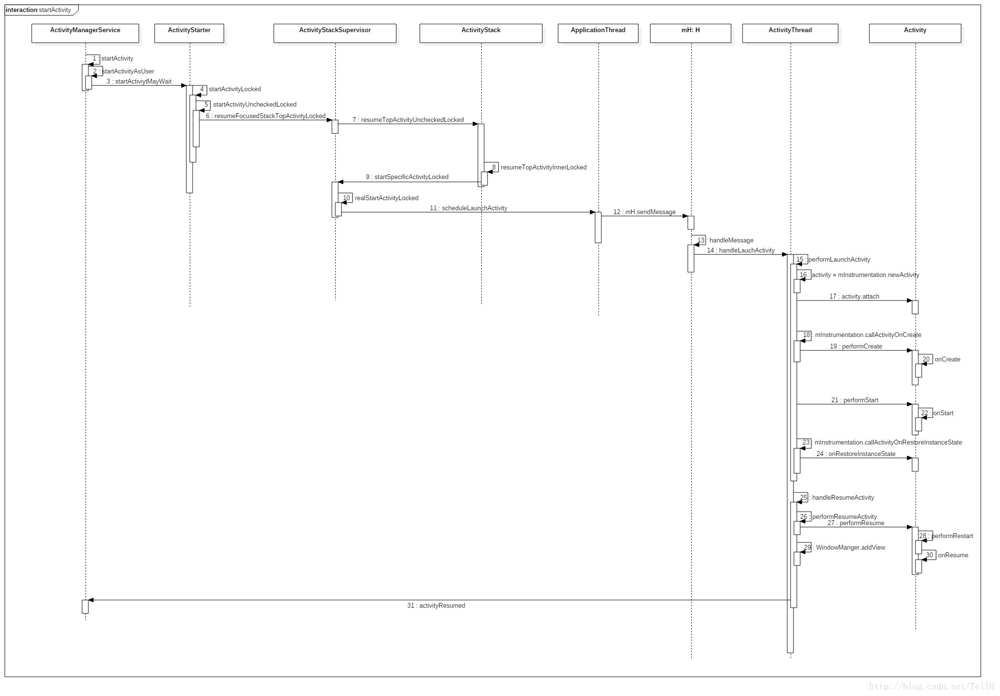

加载插件Activity时遇到下述问题：java.lang.IllegalStateException: You need to use a Theme.AppCompat theme (or descendant) with this activity

解决方式：构建插件请使用gradle assemblePlugin，而不能直接通过AndroidStudio run出来一个插件apk。


### 1. 解析插件APK

使用PackageParser分析APK，主要是利用XMLPullParser解析AndroidMenifest.xml文件，获取包名（package）、Activity等信息。


### 2. 支持插件Activity

我们都知道，Android里面无法启动一个没有在Manifest中注册的Activity。插件对于宿主而言是个黑盒，也就是说常规方法无法启动插件中的Activity，那么VirtualAPK具体是怎么做到的呢？

##### 2.1 Activity启动流程介绍

看下Activity启动流程中相关方法的调用逻辑：

```
-> Context.startActivity()
-> ContextImpl.startActivity()
-> Instrumentation.execStartActivity()
-> ActivityManagerProxy.startActivity()
-> ActivityManagerService.startActivity()
-> ActivityStackSupervisor.startActivityLocked() 
...
-> ActivityThread.scheduleLaunchActivity()
-> ActivityThread.handleLaunchActivity()
-> ActivityThread.performLaunchActivity()
...
```

从网上找了张图片，细节可看下面这张图：



AMS：

Activity的管理采用binder机制，管理Activity的接口是IActivityManager。ActivityManagerService实现了Activity管理功能,位于system_server进程。从ActivityManagerService提供的接口来看，它负责管理Activity的启动和生命周期。

ActivityManagerProxy：

ActivityManagerProxy对象是ActivityManagerService在普通应用进程的一个代理对象，应用进程通过ActivityManagerProxy对象调用ActivityManagerService提供的功能。应用进程并不会直接创建ActivityManagerProxy对象，而是通过调用ActiviyManagerNative类的工具方法getDefault方法得到ActivityManagerProxy对象。所以在应用进程里通常这样启动Activty:

```
ActivityManagerNative.getDefault().startActivity()
```


##### 2.2 Activity安全校验

跟进startActivity的调用流程，会发现其最终会进入Instrumentation的execStartActivity方法，然后再通过ActivityManagerProxy与AMS进行交互。

Activity是否存在的校验是发生在AMS端（实现细节可参考ActivityStackSupervisor.startActivityLocked方法），Instrumentation根据AMS侧返回的校验结果，在Instrumentation.checkStartActivityResult方法中抛出对应的异常。

Instrumentation.class

```
public ActivityResult execStartActivity(...) {
        ...
        int result = ActivityManagerNative.getDefault()
            .startActivity(whoThread, who.getBasePackageName(), intent,
                    intent.resolveTypeIfNeeded(who.getContentResolver()),
                    token, target != null ? target.mEmbeddedID : null,
                    requestCode, 0, null, options);
        checkStartActivityResult(result, intent);
        ...
    }

// 根据AMS侧的校验结果抛出对应异常
public static void checkStartActivityResult(int res, Object intent) {
        if (res >= ActivityManager.START_SUCCESS) {
            return;
        }
        
        switch (res) {
            case ActivityManager.START_INTENT_NOT_RESOLVED:
            case ActivityManager.START_CLASS_NOT_FOUND:
                if (intent instanceof Intent && ((Intent)intent).getComponent() != null)
                    throw new ActivityNotFoundException(
                            "Unable to find explicit activity class "
                            + ((Intent)intent).getComponent().toShortString()
                            + "; have you declared this activity in your AndroidManifest.xml?");
                throw new ActivityNotFoundException(
                        "No Activity found to handle " + intent);
            
            ...
        }
    }
```

所以我们在于AMS交互前，提前将Activity的ComponentName进行替换为占坑的名字不就好了么？
这里可以选择hook Instrumentation，或者ActivityManagerProxy都可以达到目标，VirtualAPK选择了hook Instrumentation.

那VirtualAPK如何hook Instrumentation的呢？

看下PluginManager：

```
private void hookInstrumentationAndHandler() {
        try {
            Instrumentation baseInstrumentation = ReflectUtil.getInstrumentation(this.mContext);
            if (baseInstrumentation.getClass().getName().contains("lbe")) {
                // reject executing in paralell space, for example, lbe.
                System.exit(0);
            }

            final VAInstrumentation instrumentation = new VAInstrumentation(this, baseInstrumentation);
            Object activityThread = ReflectUtil.getActivityThread(this.mContext);
            ReflectUtil.setInstrumentation(activityThread, instrumentation);
            ReflectUtil.setHandlerCallback(this.mContext, instrumentation);
            this.mInstrumentation = instrumentation;
        } catch (Exception e) {
            e.printStackTrace();
        }
    }
```

其中mContext是宿主APP的Application Context。替换工作主要是将Context的mInstrumentation对象替换为VAInstrumentation对象。那么，启动Activity时，执行的其实是VAInstrumentation。

启动目标Activity时，比如PluginDemo中的BookManagerActivity，先hook Instrumentation，将目标Activity替换为占坑Activity，其中占坑Activity已经在宿主App中注册，所以不会出现问题了。具体的替换逻辑看下面。

##### 2.2 替换目标Activity

通过对Activity启动流程的分析，startActivity后会执行VAInstrumentation.execStartActivity()、ComponentsHandler.markIntentIfNeeded()

```
ComponentsHandler.class

public void markIntentIfNeeded(Intent intent) {
        if (intent.getComponent() == null) {
            return;
        }

        String targetPackageName = intent.getComponent().getPackageName();
        String targetClassName = intent.getComponent().getClassName();
        // search map and return specific launchmode stub activity
        if (!targetPackageName.equals(mContext.getPackageName()) && mPluginManager.getLoadedPlugin(targetPackageName) != null) {
            intent.putExtra(Constants.KEY_IS_PLUGIN, true);
            intent.putExtra(Constants.KEY_TARGET_PACKAGE, targetPackageName);
            intent.putExtra(Constants.KEY_TARGET_ACTIVITY, targetClassName);
            dispatchStubActivity(intent);
        }
    }
```

这块逻辑主要讲要启动的目标Activity存储到Intent中，方便“欺上瞒下”之后再拿出来启动。

Activity替换的实现在下面：

```
ComponentsHandler.class

private void dispatchStubActivity(Intent intent) {
		// 此处component还是BookManagerActivity
        ComponentName component = intent.getComponent();
        String targetClassName = intent.getComponent().getClassName();
        LoadedPlugin loadedPlugin = mPluginManager.getLoadedPlugin(intent);
        ActivityInfo info = loadedPlugin.getActivityInfo(component);
        if (info == null) {
            throw new RuntimeException("can not find " + component);
        }
        int launchMode = info.launchMode;
        Resources.Theme themeObj = loadedPlugin.getResources().newTheme();
        themeObj.applyStyle(info.theme, true);
        
        // 根据launchMode获取占坑Activity，占坑Activity格式类似于“com.didi.virtualapk.core.A$1”
        String stubActivity = mStubActivityInfo.getStubActivity(targetClassName, launchMode, themeObj);
        Log.i(TAG, String.format("dispatchStubActivity,[%s -> %s]", targetClassName, stubActivity));
        
        // 将BookManagerActivity替换成占坑Activity
        intent.setClassName(mContext, stubActivity);
    }
```

在StubActivityInfo.getStubActivity中拿到占坑Activity，把目标Activity替换掉，后续AMS侧校验的时候，就不会出现问题。

看下获取占坑Activity的逻辑，主要是根据launchMode、Theme选择占坑Activity。

```
StubActivityInfo.class

public static final String corePackage = "com.didi.virtualapk.core";
public static final String STUB_ACTIVITY_STANDARD = "%s.A$%d";
public static final String STUB_ACTIVITY_SINGLETOP = "%s.B$%d";
public static final String STUB_ACTIVITY_SINGLETASK = "%s.C$%d";
public static final String STUB_ACTIVITY_SINGLEINSTANCE = "%s.D$%d";

public String getStubActivity(String className, int launchMode, Theme theme) {
        ...
        
        stubActivity = String.format(STUB_ACTIVITY_STANDARD, corePackage, usedStandardStubActivity);
        switch (launchMode) {
            case ActivityInfo.LAUNCH_MULTIPLE: {
	            // format后的结果类似于“com.didi.virtualapk.core.A$1”，这个Activity是在AndroidManifest中注册过的
                stubActivity = String.format(STUB_ACTIVITY_STANDARD, corePackage, usedStandardStubActivity);
                if (windowIsTranslucent) {
                    stubActivity = String.format(STUB_ACTIVITY_STANDARD, corePackage, 2);
                }
                break;
            }
           ...
        }

        mCachedStubActivity.put(className, stubActivity);
        return stubActivity;
    }
```

宿主APP，AndroidManifest.xml中预先注册一些占坑Activity。

```
<application>
        <!-- Stub Activities -->
        <activity android:name=".A$1" android:launchMode="standard"/>
        <activity android:name=".A$2" android:launchMode="standard"
            android:theme="@android:style/Theme.Translucent" />

        <!-- Stub Activities -->
        <activity android:name=".B$1" android:launchMode="singleTop"/>
        <activity android:name=".B$2" android:launchMode="singleTop"/>

        <!-- Stub Activities -->
        <activity android:name=".C$1" android:launchMode="singleTask"/>
        <activity android:name=".C$2" android:launchMode="singleTask"/>

        <!-- Stub Activities -->
        <activity android:name=".D$1" android:launchMode="singleInstance"/>
        <activity android:name=".D$2" android:launchMode="singleInstance"/>
		...
</application>
```

##### 2.3 还原目标Activity

虽然将目标Activity替换成占坑Activity，避免了启动一个没在Manifest中注册的Activity的错误。但是最终需要启动的不可能是占坑Activity，而是目标Activity。

通过上面对Activity启动流程的分析，startActivity后会执行到ActivityThread.performLaunchActivity()。这个方法里面会执行Instrumentation.newActivity()，实例化目标Activity。看看VAInstrumentation这块的实现：

VAInstrumentation.class

```
@Override
public Activity newActivity(ClassLoader cl, String className, Intent intent) throws InstantiationException, IllegalAccessException, ClassNotFoundException {
    try {
        cl.loadClass(className);
    } catch (ClassNotFoundException e) {
	    //根据Intent获取目标Activity
        ComponentName component = PluginUtil.getComponent(intent);
        LoadedPlugin plugin = this.mPluginManager.getLoadedPlugin(component);
        String targetClassName = component.getClassName();

        if (plugin != null) {
        	// 利用ClassLoader实例化目标Activity
            Activity activity = mBase.newActivity(plugin.getClassLoader(), targetClassName, intent);
            activity.setIntent(intent);
            ...
            return activity;
        }
    }
    return mBase.newActivity(cl, className, intent);
}

```

先根据Intent获取目标Activity，即BookManagerActivity，然后利用ClassLoader（plugin.getClassLoader()）实例化目标Activity，把占坑Activity替换掉，即可启动目标Activity。

总结来说，通过Hook Instrumentation，将目标Activity替换成已经在宿主APP中注册的占坑Activity，绕过AMS侧的校验，然后再替换回来，启动目标Activity。


### 3. 支持插件Service


参考：

[VirtualAPK](https://github.com/didi/VirtualAPK)

[滴滴插件化方案 VirtualApk 源码解析](https://blog.csdn.net/lmj623565791/article/details/75000580)

[Activity启动流程(基于Android26)](https://juejin.im/entry/5abdcdea51882555784e114d)

[图解Activity的启动过程](https://blog.csdn.net/TellH/article/details/57418651)