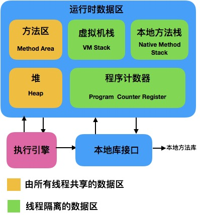
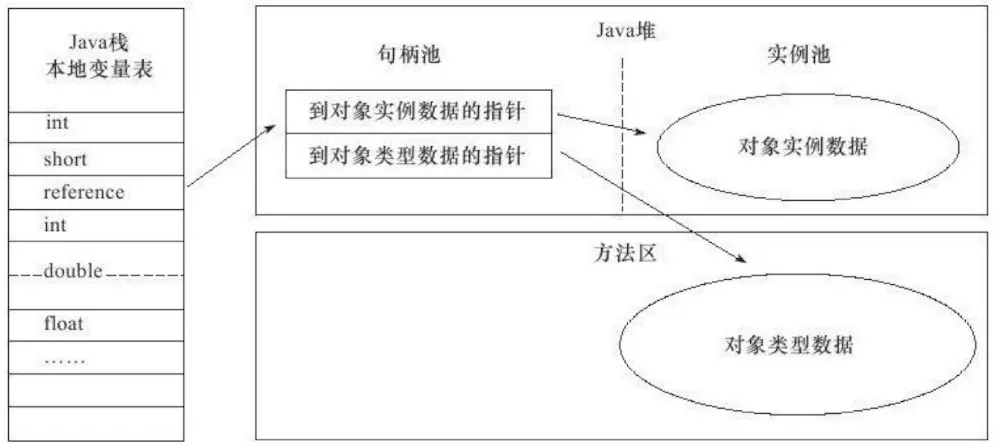
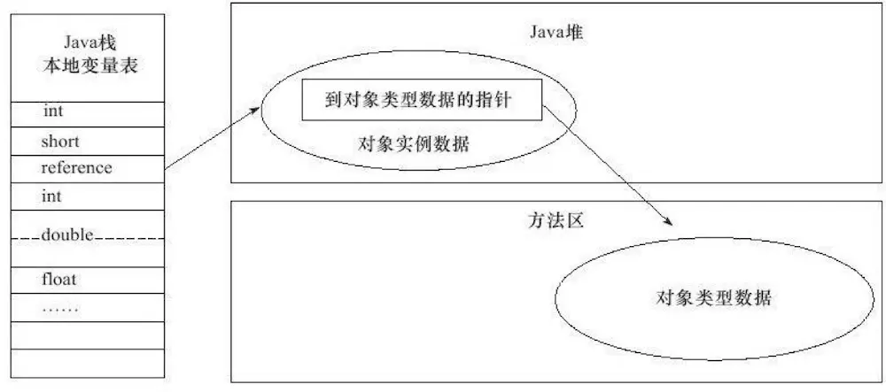

### 概述

> Java与C++之间有一堵由``内存动态分配``和``垃圾回收机制``所围成的高墙，墙外面的人想进去，墙里面的人出不来。

### JVM的内存划分

> JVM执行Java程序的过程：Java源代码文件(.java)会被Java编译器编译为字节码文件(.class)，然后由JVM中的类加载器加载各个类的字节码文件，加载完毕之后，交由JVM执行引擎执行。

在上述过程中，JVM会用一段空间来存储执行程序期间需要用到的数据和相关信息，这段空间就是``运行时数据区（Runtime Data Area）``，也就是常说的JVM内存。JVM会将它所管理的内存划分为若干个不同的数据区域，划分结果如图：

运行时数据区被分为``线程私有数据区``和``线程共享数据区``两大类:

- 线程私有数据区包含：程序计数器、虚拟机栈、本地方法栈
- 线程共享数据区包含：Java堆、方法区（内部包含常量池）

#### 1.程序计数器（Program Counter Register）
* 是``当前线程``所执行的字节码的行号计数器。
  * 如果线程正在执行的是一个Java方法，那么计数器记录的是正在执行的虚拟机字节码指令的地址。
  * 如果线程正在执行的是一个Native方法，那么计数器的值则为空。

> 字节码解释器工作时，就是通过改变这个计数器的值来选取下一条需要执行的字节码指令，分支、循环、跳转、异常处理、线程恢复等基础功能都需要依赖这个计数器来完成。

* 为了线程切换后能恢复到正确的执行位置，每条线程都需要有一个独立的程序计数器，各条线程之间计数器互不影响，独立存储，因此它是线程私有的内存.
* 在Java虚拟机规范中，是唯一一个没有规定任何OutOfMemoryError情况的区域。

#### 2.Java虚拟机栈（Java Virtual Machine Stacks）

* 是``Java方法``执行的内存模型。
  * 每个方法在执行的同时都会创建一个栈帧，用于存储局部变量表、操作数栈、动态链接、方法出口等信息。
  * 每一个方法从调用直至执行完成的过程，就对应着一个栈帧在虚拟机栈中入栈道出栈的过程。

> 局部变量表存放了编译期可知的各种基本数据类型、对象引用类型和returnAddress类型，它所需的内存空间在编译期间完成分配。
* 是线程私有的内存，与线程生命周期相同。
* 一般把Java内存区分为堆内存（Heap）和栈内存（Stack），其中『栈』指的是虚拟机栈，『堆』指的是Java堆。
* 在Java虚拟机规范中，对这个区域规定了两种异常状况：
  * 如果线程请求的栈深度大于虚拟机所允许的深度，将抛出StackOverflowError异常；
  * 如果虚拟机栈可动态扩展且扩展时无法申请到足够的内存，将抛出OutOfMemoryError异常。

#### 3.本地方法栈（Native Method Stack）
* 是虚拟机使用到的Native方法服务。
* 在虚拟机规范中，对这个区域无强制规定，由具体的虚拟机自由实现。与虚拟机栈一样，本地方法栈区域也会抛出StackOverflowError和OutOfMemoryError异常。

#### 4.Java堆（Java Heap）
* 用于存放几乎所有的对象实例和数组。
* 被所有线程共享的一块内存区域，在虚拟机启动时创建。

> 在Java堆中，可能划分出多个``线程私有``的分配缓冲区（Thread Local Allocation Buffer，TLAB），但无论哪个区域，存储的都仍然是对象实例，进一步划分的目的是为了更好地回收内存，或者更快地分配内存。

* 是垃圾收集器管理的重要区域，也被称作“GC堆”。
* 是Java虚拟机所管理内存中最大的一块。
* 可处于物理上不连续的内存空间中，只要逻辑上连续即可。
* 在Java虚拟机规范中，如果在堆中没有完成内存分配，且堆也无法再扩展时，将会抛出OutOfMemoryError异常。

#### 5.方法区（Method Area）
* 用于存储已被虚拟机加载的类信息、常量、静态变量、即时编译器编译后的代码等数据。
* 与Java堆一样，是各个线程共享的内存区域。
* 人们更愿意把这个区域称为“永久代”（Permanent Generation），在发布的JDK1.7的HotSpot中，已经把原本放在永久代的字符串常量池移出。它还有个别名叫做Non-Heap（非堆）。
* 和Java堆一样不需要连续的内存和可以选择固定大小或可扩展外，还可选择不实现GC。
* 在Java虚拟机规范中，当方法区无法满足内存分配需求时，将抛出OutOfMemoryError异常。

#### 6.运行时常量池（Runtime Constant Pool）

> Class文件中除了有类的版本、字段、方法、接口等描述信息外，还有一项信息是常量池（Constant Pool Table），用于存放编译期生成的各种字面量和符号引用，这部分内容将在类加载后进入方法区的运行时常量池中存放。

* 相对于Class文件常量池的一个重要特征是具备动态性，体现在并非只有预置入Class文件中常量池的内容才能进入方法区运行时常量池，运行期间也可能将新的常量放入池中。
* 是方法区的一部分，会受到方法区内存的限制。
* 在Java虚拟机规范中，当常量池无法再申请到内存时会抛出OutOfMemoryError异常。

### HotSpot虚拟机对象探秘

> 在大致知道了虚拟机内存的概况后，要想进一步了解这些虚拟机内存中的数据的其他细节，我们针对常用的虚拟机HotSpot和常用的内存区域Java堆为例，探讨HotSpot在Java堆中对象的分配、布局和访问的全过程。

#### 1.对象的创建

* 类加载检查
虚拟机遇到一条new指令时，首先将去检查new指令的参数是否能在常量池中定位到一个类的符号引用并且该符号引用代表的类是否被加载、解析和初始化过，若没有，则需要执行相应的类加载过程。
* 分配内存：由Java堆中的内存是否规整决定如何给新生对象分配内存。
  * 若规整，采用“指针碰撞”分配方式：
    * 过程：将用过的内存放在一边，空闲的内存放在另一边，中间放着指针作为分界点的指示器，分配内存时把指针向空闲空间挪过一段与对象大小相等的距离。
    * 应用：使用Serial，ParNew等带Compact过程的收集器是，会采用指针碰撞来分配。
  * 若不规整，采用“空闲列表”分配方式：
    * 过程：维护一个记录可用内存的列表。当分配内存时，找到一块足够大的空间划分给对象实例并更新表记录。
    * 应用：使用CMS这种基于Mark-Sweep算法的收集器，会采用空闲列表。

> 保证内存分配是线程安全的解决方案：
* 对分配内存空间的动作进行同步处理(方法是采用CAS和失败重试来保证更新操作的原子性)
* 把内存分配的动作按照线程划分在不同的空间之中进行(每个线程在Java堆中预先分配一小块内存，称为本地线程分配缓冲(Thread Local Allocation Buffer,TLAB),当TLAB用完需要重新分配新的TLAB再同步锁定)。

* 设置对象头：将对象的所属类、找到类的元数据信息的方式、对象的哈希码、对象的GC分代年龄等信息存放在对象的对象头中。
> 经过上述步骤，一个对象就产生了，但此时所有的字段都还为零，还需要执行``<init>``方法进行初始化，才能成为真正可用的对象。

#### 2.对象的内存布局
分为3块区域：对象头(Header),实例数据(Instance Data)和对齐填充(Padding).
* 对象头分为两部分信息
  * Mark Word：用于存储对象自身的运行时数据，如哈希吗，GC分代年龄、所状态标志、线程持有的锁、偏向线程ID、偏向时间戳等。
  * 类型指针：用于确定这个对象是那个类的实例。

* 实例数据：存储真正的有效信息，是程序代码中定义的各种类型的字段内容。存储顺序会受虚拟机分配策略参数和字段在Java源码中定义顺序这两个因素影响。
* 对齐填充：占位符，帮助补全未对齐的对象实例数据部分（保证是8字节的倍数），非必需。

#### 3.对象的访问定位:主流有使用句柄和直接指针两种方式
* 使用句柄：：在Java堆中划分出一块内存来作为句柄池，reference存储的是对象的句柄地址，在句柄中包含了对象实例数据与类型数据各自的具体地址信息。好处：reference中存储的是稳定的句柄地址，在对象被移动时只会改变句柄中的实例数据指针，而reference本身不需要修改。

* 通过直接指针访问对象：在Java堆对象的布局中考虑如何放置访问类型数据的相关信息，reference存储的直接就是对象地址。好处：速度更快，节省了一次指针定位的时间开销。

