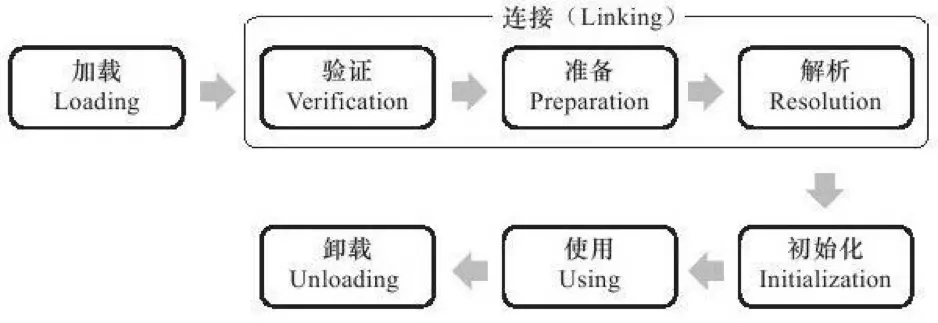

### 类的加载过程

``JVM类加载机制``：虚拟机把描述类的数据从Class文件加载到内存，并对数据进行校验、转换解析和初始化，最终形成可以被虚拟机直接运营的Java类型，这就是虚拟机的类加载机制。

``动态扩展的特性``：在Java语言里面，类型的加载、链接和初始化过程都是在程序运行期间完成的，这种策略虽然会零类加载时稍微增加一些性能开销，但是回味Java应用程序提供高度的灵活性，Java里天生可以动态扩展的语言特性就是依赖运行期动态加载和动态链接这个特点完成的。

#### 类加载的时机
类从被加载到虚拟机内存中开始，到卸载出内存为止，它的整个生命周期如下：
* 加载（Loading）
* 验证（Verification）
* 准备（Preparation）
* 解析（Resolution）
* 初始化（Initialization）
* 使用（Using）
* 卸载（Unloading）

其中验证、准备、解析这3个部分称为连接（Linking）。

> 注意：
> 加载、验证、准备、初始化和卸载这5个阶段的顺序是固定的，累得加载过程必须按照找各种顺序来执行，而解析阶段则不一定；
> 为了支持Java语言的运行时绑定，解析在某些情况下可以在初始化阶段之后再开始。

#### 加载
“加载”是”类加载“（Class Loading）过程的一个阶段。
1. 通过一个累得全限定名来获取定义此类的``二进制字节流``。
2. 将这个字节流所代表的``静态存储结构``转化为方法区的``运行时数据结构``。
3. 在内存中生成一个代表这个类的``java.lang.Class``对象，作为方法区这个类的各种的数据访问接口。

#### 验证
* 验证是连接阶段的第一步，且工作量在虚拟机的类加载子系统中战略相当大的一部分。
* 目的：为了确保Class文件的字节流中包含的信息符合当前虚拟机的要求，并且不会危害虚拟机自身的安全。

> 由此可见，它能直接决定JVM能否承受恶意代码的攻击，因此验证阶段很有必要，但由于它对程序运行期没有影响，并不一定必要，可以考虑使用-Xverify：none参数来关闭大部分的类验证措施，以缩短虚拟机类加载的时间。

验证过程大致上可以分为4个检验动作：
* 文件格式验证
  * 内容：验证字节流是否符合Class文件格式的规范、以及是否能被当前版本的虚拟机处理。
  * 目的：保证输入的字节流能正确地解析并存储于方法区之内，且格式上符合描述一个Java类型信息的要求。只有保证二进制字节流通过了该验证后，它才会进入内存的方法区中进行存储，所以后续3个验证阶段全部是基于方法区而不是字节流了。

* 元数据验证
  * 内容：对字节码描述的信息进行语义分析，以保证其描述的信息符合Java语言规范的要求。
  * 目的：对类的元数据信息进行语义校验，保证不存在不符合Java语言规范的元数据信息。

* 字节码验证：是验证过程中最复杂的一个阶段。
  * 内容：对类的方法体进行校验分析，保证被校验类的方法在运行时不会做出危害虚拟机安全的事件。
  * 目的：通过数据流和控制流分析，确定程序语义是合法的、符合逻辑的。

* 符号引用验证：
  * 内容：对类自身以外（如常量池中的各种符号引用）的信息进行匹配性校验。
  * 目的是确保解析动作能正常执行，如果无法通过符号引用验证，那么将会抛出一个java.lang.IncompatibleClassChangeError异常的子类。
  * 注意：该验证发生在虚拟机将符号引用转化为直接引用的时候，即『解析』阶段。

https://www.jianshu.com/p/9ea809edebb6