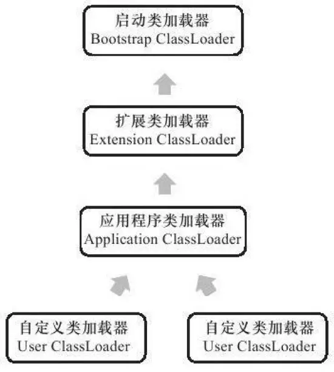

### 类的加载过程

``JVM类加载机制``：虚拟机把描述类的数据从Class文件加载到内存，并对数据进行校验、转换解析和初始化，最终形成可以被虚拟机直接运营的Java类型，这就是虚拟机的类加载机制。

``动态扩展的特性``：在Java语言里面，类型的加载、链接和初始化过程都是在程序运行期间完成的，这种策略虽然会零类加载时稍微增加一些性能开销，但是回味Java应用程序提供高度的灵活性，Java里天生可以动态扩展的语言特性就是依赖运行期动态加载和动态链接这个特点完成的。

#### 类加载的时机
类从被加载到虚拟机内存中开始，到卸载出内存为止，它的整个生命周期如下：
* 加载（Loading）
* 验证（Verification）
* 准备（Preparation）
* 解析（Resolution）
* 初始化（Initialization）
* 使用（Using）
* 卸载（Unloading）

其中验证、准备、解析这3个部分称为连接（Linking）。

> 注意：
> 加载、验证、准备、初始化和卸载这5个阶段的顺序是固定的，累得加载过程必须按照找各种顺序来执行，而解析阶段则不一定；
> 为了支持Java语言的运行时绑定，解析在某些情况下可以在初始化阶段之后再开始。

#### 加载
“加载”是”类加载“（Class Loading）过程的一个阶段。
1. 通过一个累得全限定名来获取定义此类的``二进制字节流``。
2. 将这个字节流所代表的``静态存储结构``转化为方法区的``运行时数据结构``。
3. 在内存中生成一个代表这个类的``java.lang.Class``对象，作为方法区这个类的各种的数据访问接口。

#### 验证
* 验证是连接阶段的第一步，且工作量在虚拟机的类加载子系统中战略相当大的一部分。
* 目的：为了确保Class文件的字节流中包含的信息符合当前虚拟机的要求，并且不会危害虚拟机自身的安全。

> 由此可见，它能直接决定JVM能否承受恶意代码的攻击，因此验证阶段很有必要，但由于它对程序运行期没有影响，并不一定必要，可以考虑使用-Xverify：none参数来关闭大部分的类验证措施，以缩短虚拟机类加载的时间。

验证过程大致上可以分为4个检验动作：
* 文件格式验证
  * 内容：验证字节流是否符合Class文件格式的规范、以及是否能被当前版本的虚拟机处理。
  * 目的：保证输入的字节流能正确地解析并存储于方法区之内，且格式上符合描述一个Java类型信息的要求。只有保证二进制字节流通过了该验证后，它才会进入内存的方法区中进行存储，所以后续3个验证阶段全部是基于方法区而不是字节流了。

* 元数据验证
  * 内容：对字节码描述的信息进行语义分析，以保证其描述的信息符合Java语言规范的要求。
  * 目的：对类的元数据信息进行语义校验，保证不存在不符合Java语言规范的元数据信息。

* 字节码验证：是验证过程中最复杂的一个阶段。
  * 内容：对类的方法体进行校验分析，保证被校验类的方法在运行时不会做出危害虚拟机安全的事件。
  * 目的：通过数据流和控制流分析，确定程序语义是合法的、符合逻辑的。

* 符号引用验证：
  * 内容：对类自身以外（如常量池中的各种符号引用）的信息进行匹配性校验。
  * 目的是确保解析动作能正常执行，如果无法通过符号引用验证，那么将会抛出一个java.lang.IncompatibleClassChangeError异常的子类。
  * 注意：该验证发生在虚拟机将符号引用转化为直接引用的时候，即『解析』阶段。

#### 准备
* 为类变量``分配内存``：因为这里的变量是由方法区分配内存的，所以仅包括类变量而不包括实例变量，后者将在对象实例化时随着对象一起在堆上分配。
* 设置类变量``初始值``：通常情况下零值，但是如果这个类变量被final修饰，编译时Javac将会为该变量生成ConstantValue属性，在准备阶段虚拟机就会根据ConstantValue的设置将该变量赋值为等于号后面的值。

#### 解析
解析阶段是虚拟机将``常量池``内的符号引用替换为直接引用的过程。
* 符号引用：以一组符号来描述所引用的目标。
  * 可以是任何形式的字面量，只要使用时能无歧义地定位到目标即可。
  * 与虚拟机的内存布局无关，因为符号引用的字面量形式明确定义在Java虚拟机规范的Class文件格式中，所有即使各种虚拟机的实现的内存布局不同，但是能接受符号引用都是一致的。
* 直接引用：
  * 可以是直接指向目标的指针、相对偏移量或是一个能间接定位到目标的句柄。
  * 与虚拟机实现的内存布局有关，同一个符号引用在不同的虚拟机实例上翻译出来的直接引用一般不同。

* ``发生时间``：JVM会根据需要来判断，是在类被加载器``加载时``就对常量池中的符号引用进行解析，还是等到一个符号引用将要被``使用前``才去解析。

* 解析动作：有7类符号及其对应在常量池的7种常量类型
  * 类或接口(CONSTANT_Class_info)
  * 字段(CONSTANT_Fieldref_info)
  * 类方法(CONSTANT_Methodref_info)
  * 接口方法(CONSTANT_InterfaceMethodref_info)
  * 方法类型(CONSTANT_MethodType_info)
  * 方法句柄(CONSTANT_MethodHandle_info)
  * 调用点限定符(CONSTANT_InvokeDynamic_info)

> 举个例子，设当前代码所处的为类D，把一个从未解析过的符号引用N解析为一个类或接口C的直接引用，解析过程分三步：

* 若C不是数组类型：JVM将会把代表N的全限定名传递给D类加载器去加载这个类C。在加载过程中，由于元数据验证、字节码验证的需要，又可能触发其他相关类的加载动作。一旦这个加载过程出现了任何异常，解析过程就宣告失败。
* 若C是数组类型且数组元素类型为对象：JVM也会按照上述规则加载数组元素类型。
* 若上述步骤无任何异常：此时C在JVM中已成为一个有效的类或接口，但在解析完成前还需进行符号引用验证，来确认D是否具备对C的访问权限。如果发现不具备访问权限，将抛出java.lang.IllegalAccessError异常。

#### 初始化
* 类初始化是类加载过程的最后一步，会真正开始执行类中定义的Java程序代码（或者说是字节码）。而之前的类加载过程中，除了在『加载』阶段用户应用程序可通过自定义类加载器参与之外，其余阶段均由虚拟机主导和控制。
* 与准备阶段的区分：
  * 准备阶段：变量赋初始零值。
  * 初始化阶段：根据Java程序的设定去初始化类变量和其他资源，或者说是执行``<cinit>()``过程。

``<clinit>()``：由编译器自动收集类中的所有类变量的赋值动作和静态语句块static{}中的语句合并产生。
* 是线程安全的，在多线程环境中会被正确地加锁、同步。
* 对于类和接口是非必需的，如果一个类中没有静态语句块，也没有对变量的赋值操作，那么编译器可以不为这个类生成 ``<clinit>()``。
* 接口与类不同的是，执行接口的`` <clinit>()``不需要先执行父接口的 ``<clinit>()``，只有当父接口中定义的变量使用时，父接口才会初始化。另外，接口的实现类在初始化时也一样不会执行接口的``<clinit>()``。

在虚拟机规范中，规定了有且只有5中情况必须立即对类进行初始化：
* 遇到new、getstatic、putstatic或invokestatic这4条字节码指令时；
* 使用java.lang.reflect包的方法对类进行反射调用的时候；
* 当初始化一个类的时候，若发现其父类还未进行初始化，需先触发其父类的初始化；
* 在虚拟机启动时，需指定一个要执行的主类，虚拟机会先初始化它；
* 当使用JDK1.7的动态语言支持时，若一个java.lang.invoke.MethodHandle实例最后的解析结果为REF_getStatic、REF_putStatic、REF_invokeStatic的方法句柄，且这个方法句柄所对应的类未进行初始化，需先触发其初始化。

### 类加载器和双亲委托模型
> 每个类加载器都拥有一个独立的类名称空间，它不仅用于加载类，还和这个类本身一起作为在JVM中的唯一标识。所以比较两个类是否相等，只要看它们是否由同一个类加载器加载，即使它们来源于同一个Class文件且被同一个JVM加载，只要加载它们的类加载器不同，这两个类就必定不相等。

从JVM的角度来讲，只有两种不同的类加载器：
* 一种是启动类加载器（Bootstrap ClassLoader）
  * 由C++语言编写，是虚拟机自身的一部分。
  * 负责加载<JAVA_HOME>\lib目录下，或者被-Xbootclasspath参数指定的路径中的且可被虚拟机识别的类库。
  * 无法被Java程序直接引用，如果自定义类加载器想要把加载请求委派给引导类加载器的话，可直接用null代替。
* 另一种是其他类加载器：由Java语言实现，独立于虚拟机外部，并且全部都继承自抽象类java.lang.ClassLoader,可被Java程序直接引用。
  * 扩展类加载器（Extension ClassLoader）
    * 由sun.misc.Launcher$ExtClassLoader实现。
    * 负责加载＜JAVA_HOME＞\lib\ext目录中的、或者被java.ext.dirs系统变量所指定的路径中的所有类库。
  * 应用程序类加载器（Application ClassLoader）
    * 是默认的类加载器，是ClassLoader#getSystemClassLoader()的返回值，故又称为系统类加载器。
    * 由sun.misc.Launcher$App-ClassLoader实现。
    * 负责加载用户类路径上所指定的类库。
  * 自定义类加载器（User ClassLoader）：如果以上类加载起不能满足需求，可自定义。

关系图如下：

> 虽然数组类不通过类加载器创建而是由JVM直接创建的，但仍与类加载器有密切关系，因为数组类的元素类型最终还要靠类加载器去创建。

#### 双亲委派模型（Parents Delegation Model）
* 表示类加载器之间的层次关系。
* 前提：除了顶层启动类加载器外，其余类加载器都应当有自己的父类加载器，且它们之间关系一般不会以继承（Inheritance）关系来实现，而是通过组合（Composition）关系来复用父加载器的代码。
* 工作过程：若一个类加载器收到了类加载的请求，它先会把这个请求委派给父类加载器，并向上传递，最终请求都传送到顶层的启动类加载器中。只有当父加载器反馈自己无法完成这个加载请求时，子加载器才会尝试自己去加载。
* 注意：不是一个强制性的约束模型，而是Java设计者推荐给开发者的一种类加载器实现方式。
* 优点：类会随着它的类加载器一起具备带有优先级的层次关系，可保证Java程序的稳定运作；实现简单，所有实现代码都集中在java.lang.ClassLoader的loadClass()中。

> 比如，某些类加载器要加载java.lang.Object类，最终都会委派给最顶端的启动类加载器去加载，这样Object类在程序的各种类加载器环境中都是同一个类。相反，系统中将会出现多个不同的Object类，Java类型体系中最基础的行为也就无法保证，应用程序也将会变得一片混乱。
