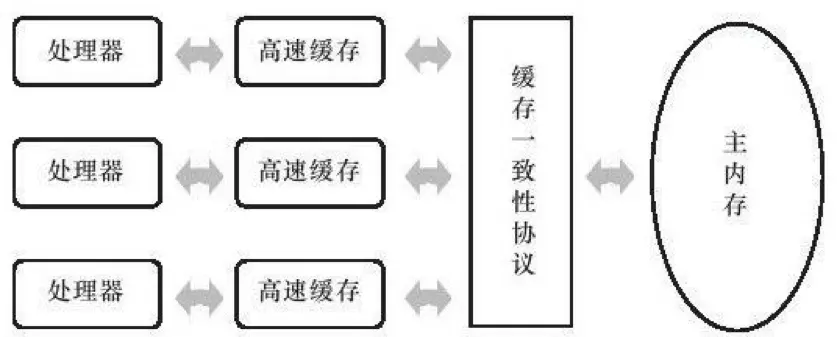

### 概述
> 多任务处理在现代计算机操作系统的必要性。
首先要充分利用计算机处理器的运算能力，由于计算机的运算速度与它的存储和通信子系统速度差距太大，不能让大量的时间被浪费在磁盘I/O、网络通信或者数据库访问上。
另外，并发能够让一个服务端同时对多个客户端提供服务。衡量一个服务性能的高低好坏，每秒事务处理数(Transactions Per Second,TPS)是最重要的指标之一，它代表着一秒内服务端平均能响应的请求总数。

### 硬件效率和一致性
在理解Java虚拟机并发之前，我们需要了解物理计算机中的并发问题。

由于计算机的存储设备与处理器的运算速度有几个数量级的差距，所有现代计算机系统都不得不加入一层读写速度尽可能解决处理器运算速度的高速缓存（Cache）来作为内存与处理器之间的缓冲：将运算需要使用到的数据复制到缓存中，让运算能快速运行，当运算结束后再从缓存同步回内存内存之中，这样处理器就无须等待缓慢的内存读写了。

基于高速缓存的存储交互很好地解决了处理器与内存的速度矛盾，但是也为计算机系统带来更高的复杂度，它引入了一个新的问题：缓存一致性。当多个处理器的运算任务都涉及到同一主内存区域是，将可能导致各自的缓存数据不一致。

为了解决缓存一致性，需要各个处理器访问缓存时都遵循一些协议，在读写时根据协议来操作。

本章中说到的“内存模型”，可以理解为在特定的操作协议下，对特定的内存或高速缓存进行读写访问的过程抽象。

### Java内存模型

Java虚拟机规范中试图定义一种Java内存模型（Java Memory Model，JMM）来屏蔽掉各种硬件和操作系统的内存访问差异，以实现让Java程序在各种平台下都能达到一致的内存访问效果。

> 目标
Java内存模型的主要目标是定义程序中各个变量的访问规则，即在虚拟机中将变量存储到内存和从内存中取出变量这样的的底层细节。

>注意：这里的变量与Java编程中所说的变量有所区别，它包括了实例字段、静态字段和构成数组对象的元素，但不包括局部变量与方法参数，因为后者是线程私有的，不会被独享，自然就不会存在竞争问题。

Java内存模型规定了所有的变量都存储在内存中（此处的主内存与介绍物理硬件时的主内存名字一样，两者也可以相互类比，但此处仅仅是虚拟机内存的一部分）。每条线程还有自己的工作内存，可与处理器高速缓存类似，线程的工作内存中保存了被该线程使用到的变量的主内存副本拷贝，线程对变量的所有操作（读取、赋值等）都必须在工作内存中进行，而不能直接读写主内存中的变量，线程间变量值得传递均需要通过主内存来完成。

JMM中所说的主内存、工作内存与Java内存区域中的Java堆、栈、方法区等并不是同一个层次的划分，这两者基本上是没有关系的，如果两者一定要勉强对应起来，那从变量、主内存、工作内存的定义来看，主内存主要对应于Java堆中的对象实例数据部分，而工作内存则对应于虚拟机栈中的部分区域。从更低层次上说，主内存就直接对应于物理硬件的内存，而为了获取更好的运行速度，虚拟机可能会让工作内存优先存储于寄存器和高速缓存中，因为程序运行时主要访问的是工作内存。

### 内存间交互操作
关于主内存与工作内存之间具体的交互协议，即一个变量如何从主内存拷贝到工作内存、如何从工作内存同步回主内存之类的实现细节，Java内存模型中定义了以下8种操作来完成。

虚拟机必须保证这8种操作每一种操作都是原子的，不可再分的。

* lock(锁定)： 作用域主内存中的变量，它把一个变量标识为一条线程独占的装填。
* unlock(解锁)：作用于主内存的变量，它把一个处于锁定状态的变量释放出来，释放后的变量才可以被其他线程锁定。
* read(读取)：作用于主内存中的变量，它把一个变量的值从主内存传输到线程的工作内存中，以便随后的load动作使用。
* load(载入)：作用于工作内存的变量，它把read操作从主内存中得到的变量值放入工作内存的变量副本中。
* use(使用)：作用于工作内存的变量，它把工作内存中一个变量的值传递给执行引擎，每当虚拟机遇到一个需要使用到变量的值得字节码指令时将会执行这个操作。
* assign(赋值)：作用于工作内存的变量，它把一个从执行引擎接收到的值赋值给工作内存的变量，每当虚拟机遇到一个给变量赋值的字节码指令时执行这个操作。
* store(存储)：作用于工作内存的变量，它把工作内存中的一个变量的值传送到主内存中，以便随后的write操作使用。
* write(写入)：作用于主内存的变量，它把store操作从工作内存中得到的变量的值放入主内存的变量中。

https://www.jianshu.com/p/90a036212cb4