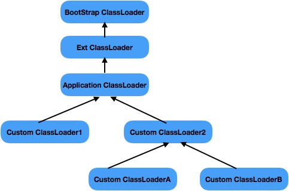

## JVM类加载器
顾名思义，类的加载器就是负责类的加载职责，对于任意一个class，都需要由加载他的类加载器和这个类本身确立其在JVM中的唯一性。

> 在深入理解Java虚拟机中有介绍，类的加载分为好几个步骤，虚拟机把描述类的数据从Class文件加载到内存，并对数据进行校验、转换解析和初始化，最终形成可以被虚拟机直接运营的Java类，这个称为类的加载，具体可以查看[JVM类加载机制](./3_JVM类加载机制.md)这篇的总结，本篇要讲的类加载器则是类的加载过程中加载这个动作具体的手段。

### JVM内置三大类加载器
JVM为我们提供了三大内置的类加载器，不同的类加载器负责将不同的类加载到JVM内存之中，并且它们严格遵守着父委托的机制。



### BootStrap ClassLoader(根类加载器)
BootStrap ClassLoader是最为顶层的加载器，其没有任何父加载器，它是由C++编写的，主要负责虚拟机核心类库的加载，比如整个java.lang包都是由BootStrap ClassLoader来加载的，可以通过-Xbootclasspath来指定BootStrap ClassLoader的加载路径，也可以通过系统属性来得知当前JVM的BootStrap ClassLoader都加载了哪些资源，示例代码如下：
```java

public class TestClassLoader {

	public static void main(String[] args) {
		System.out.println("BootStrap: " + String.class.getClassLoader());
		
		System.out.println(System.getProperty("sun.boot.class.path"));
	}

}

```

程序结果如下所示，其中String.class的类加载器是BootStrap ClassLoader，它是获取不到引用的，所以为null，而BootStrap ClassLoader所在的加载路径是可以通过sun.boot.class.path这个系统属性来获取到的。

> 注意：这里多个path是用:来隔开的，因为我是在Mac上跑的程序，如果Windows上应该是以;来分隔多个path
```
BootStrap: null
/Library/Java/JavaVirtualMachines/jdk1.8.0_171.jdk/Contents/Home/jre/lib/resources.jar:
/Library/Java/JavaVirtualMachines/jdk1.8.0_171.jdk/Contents/Home/jre/lib/rt.jar:
/Library/Java/JavaVirtualMachines/jdk1.8.0_171.jdk/Contents/Home/jre/lib/sunrsasign.jar:
/Library/Java/JavaVirtualMachines/jdk1.8.0_171.jdk/Contents/Home/jre/lib/jsse.jar:
/Library/Java/JavaVirtualMachines/jdk1.8.0_171.jdk/Contents/Home/jre/lib/jce.jar:
/Library/Java/JavaVirtualMachines/jdk1.8.0_171.jdk/Contents/Home/jre/lib/charsets.jar:
/Library/Java/JavaVirtualMachines/jdk1.8.0_171.jdk/Contents/Home/jre/lib/jfr.jar:
/Library/Java/JavaVirtualMachines/jdk1.8.0_171.jdk/Contents/Home/jre/classes
```

### Ext ClassLoader(扩展类加载器)
Ext ClassLoader的父加载器是BootStrap ClassLoader，它主要用于加载JAVA_HOME下的jre\lb\ext的子目录里面的类库。Ext ClassLoader是由纯Java语言实现的，它是java.lang.URLClassLoader的子类，它的完整类名是sun.misc.Launcher$ExtCladdLoader。Ext ClassLoader所加载的类库可以通过系统属性java.ext.dirs获得，示例代码如下：

```java
public class ExtCladdLoader {
	public static void main(String[] args) {
		System.out.println(System.getProperty("java.ext.dirs"));
	}
}
```

```
/Users/gaohui/Library/Java/Extensions:
/Library/Java/JavaVirtualMachines/jdk1.8.0_171.jdk/Contents/Home/jre/lib/ext:
/Library/Java/Extensions:
/Network/Library/Java/Extensions:
/System/Library/Java/Extensions:/usr/lib/java
```