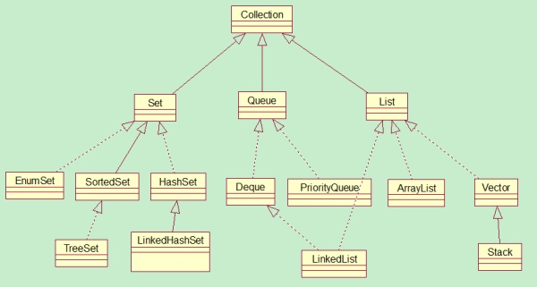
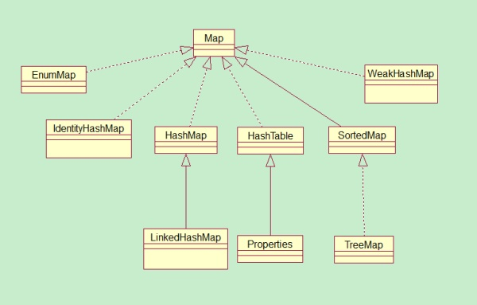

- [两大基类Collection与Map](#%E4%B8%A4%E5%A4%A7%E5%9F%BA%E7%B1%BBcollection%E4%B8%8Emap)
  - [Collection](#collection)
  - [Map](#map)
  - [List接口](#list%E6%8E%A5%E5%8F%A3)
  - [ArrayList](#arraylist)
  - [LinkedList](#linkedlist)
  - [Vector](#vector)
  - [Set接口](#set%E6%8E%A5%E5%8F%A3)
  - [HashSet](#hashset)
  - [LinkedHashSet](#linkedhashset)
  - [TreeSet](#treeset)

Java中的集合框架：是一种工具类，就像是容器，储存任意数量的具有共同属性的对象

## 两大基类Collection与Map
在集合框架的类继承体系中，最顶层有两个接口：
- Collection表示一组纯数据
- Map表示一组key-value对


一般继承自Collection或Map的集合类，会提供两个“标准”的构造函数：
- 没有参数的构造函数，创建一个空的集合类
- 有一个类型与基类（Collection或Map）相同的构造函数，创建一个与给定参数具有相同元素的新集合类
 
因为接口中不能包含构造函数，所以上面这两个构造函数的约定并不是强制性的，但是在目前的集合框架中，所有继承自Collection或Map的子类都遵循这一约定。
### Collection


如上图所示，Collection类主要有三个接口：

- Set 表示不允许有重复元素的集合（A collection that contains no duplicate elements）
- List 表示允许有重复元素的集合（An ordered collection (also known as a sequence)）
- Queue JDK1.5新增，与上面两个集合类主要是的区分在于Queue主要用于存储数据，而不是处理数据。（A collection designed for holding elements prior to processing.）

Collection接口部分源码

```java
public interface Collection<E> extends Iterable<E> {

    int size();
    boolean isEmpty();
    boolean contains(Object o);
    boolean add(E e);
    boolean remove(Object o);
    boolean containsAll(Collection<?> c);
    boolean addAll(Collection<? extends E> c);
    boolean removeAll(Collection<?> c);
    void clear();

    Iterator<E> iterator();
    Object[] toArray();
}
```

### Map


Java 中有四种常见的Map实现——HashMap, TreeMap, Hashtable和LinkedHashMap：

- HashMap就是一张hash表，键和值都没有排序。
- TreeMap以红黑树结构为基础，键值可以设置按某种顺序排列。
- LinkedHashMap保存了插入时的顺序。
- Hashtable是同步的(而HashMap是不同步的)。所以如果在线程安全的环境下应该多使用HashMap，而不是Hashtable，因为Hashtable对同步有额外的开销，不过JDK 5之后的版本可以使用ConncurrentHashMap代替HashTable。

Map接口实现的是一组Key-Value的键值对的组合。 Map中的每个成员方法由一个关键字（key）和一个值（value）构成。
> Map接口不直接继承于Collection接口（需要注意啦），因为它包装的是一组成对的“键-值”对象的集合，而且在Map接口的集合中也不能有重复的key出现，因为每个键只能与一个成员元素相对应。

另外，Set接口的底层是基于Map接口实现的。Set中存储的值，其实就是Map中的key，它们都是不允许重复的。

Map接口部分源码
```java
public interface Map<K,V> {

    int size();
    boolean isEmpty();
    boolean containsKey(Object key);
    boolean containsValue(Object value);
    V get(Object key);
    V put(K key, V value);
    void putAll(Map<? extends K, ? extends V> m);
    V remove(Object key);
    void clear();

    Collection<V> values();
    Set<K> keySet();
    Set<Map.Entry<K, V>> entrySet();
    interface Entry<K,V> {
        K getKey();
        V getValue();
        V setValue(V value);

    }
}
```

- 取出map集合中所有元素的方式一：keySet()方法

可以将map集合中的键都取出存放到set集合中。对set集合进行迭代。迭代完成，再通过get方法对获取到的键进行值的获取。

```java
    Set keySet = map.keySet();
    Iterator it = keySet.iterator();
    while(it.hasNext()) {
        Object key = it.next();
        Object value = map.get(key);
        System.out.println(key+":"+value);
    }
```
		
- 取出map集合中所有元素的方式二：entrySet()方法

```java
    Set entrySet = map.entrySet();
    Iterator it = entrySet.iterator();
    while(it.hasNext()) {
        Map.Entry  me = (Map.Entry)it.next();
        System.out.println(me.getKey()+"::::"+me.getValue());
    }
```

### List接口
List接口对Collection进行了简单的扩充，因此它继承了Collection接口。其中大部分方法和其继承的Collection相同。

特点：<br/>
List中存储的元素是有序的，而且可以重复的存储相关元素。

### ArrayList

特点：<br/>
ArrayList的底层使用数组实现，当元素的数量超过数组长度时，通过新建更大容量数组，将原数组内容拷贝一份，然后新增元素的方式存储元素。

优点:<br/>
类似数组的形式进行存储，因此它的随机访问速度极快。

缺点：<br/>
不适合于在线性表中间需要频繁进行插入和删除操作。因为每次插入和删除都需要移动数组中的元素。
可以这样理解ArrayList就是基于数组的一个线性表，只不过数组的长度可以动态改变而已。

***注意点***

1、关于扩容问题：

默认ArrayListde的默认构造函数ArrayList()会构造一个长度为10的数组。
ArrayList(int initialCapacity)构造函数会构造一个指定长度的数组。
添加元素时，如果超出了长度，则以每次旧长度的3/2倍增长。

例：

new ArrayList(20);扩容几次？
答案： 0次，因为直接产生了一个长度20的数组

2、ArrayList是线程不安全的，在多线程的情况下不要使用。

如果一定在多线程使用List的，你可以使用Vector，因为Vector和ArrayList基本一致，区别在于Vector中的绝大部分方法都使用了同步关键字修饰，这样在多线程的情况下不会出现并发错误哦，还有就是它们的扩容方案不同，ArrayList是通过原始容量*3/2，而Vector是允许设置默认的增长长度，Vector的默认扩容方式为原来的2倍（可以通过构造函数设置，如设置为2，扩容后长度为旧长度+2）。

切记Vector是ArrayList的多线程的一个替代品。

### LinkedList
特点：

LinkedList的底层用双向链表实现。另外建议阅读其源码，并不难，会让你有醍醐灌顶的感觉。

优点:

链表相对于实现ArrayList的数组来说，其存储空间是散列的而不是连续的，因此在链表中间插入和删除元素时，无需移动后面的元素，只需要改变3个节点的关联即可。

缺点：

因为LinkedList不是空间连续的，因此随机读取时，需要从头到尾的读取，因此不如ArrayList来得快。另外，在使用双向链表实现时，需要额外提供空间供记录前驱节点和后继节点的地址，消耗了额外空间。

对于使用LinkedList而言，下面几点内容一定要注意啦

1. LinkedList和ArrayList的区别和联系

主要从底层实现、优缺点（随机读取、新增、删除）等方面总结，详见之前总结的特点、优缺点，不再赘述。

2. LinkedList不是线程安全的

注意LinkedList和ArrayList一样也不是线程安全的，如果在对线程下面访问可以自己重写LinkedList

然后在需要同步的方法上面加上同步关键字synchronized

3. LinkedList可以被当做堆栈来使用

由于LinkedList实现了接口Dueue，所以LinkedList可以被当做堆栈来使用。

### Vector

Vector和ArrayList不论在实现，还是使用上，都大同小异。因此也就不细说，他们主要的不同就是Vector是线程安全的，它在一些方法上加了synchronized关键字。

> Arraylist与Vector的区别

Vector是线程安全的，ArrayList不是线程安全的。
ArrayList在底层数组不够用时在原来的基础上扩展0.5倍(3/2)，Vector是扩展1倍。

### Set接口
Set接口也是Collection接口的一个常用子接口，它区别于List接口的特点在于:

Set中的元素实现了不重复，有点象集合的概念，无序，不允许有重复的元素,最多允许有一个null元素对象。

需要注意的是：虽然Set中元素没有顺序，但是元素在Set中的位置是有由该元素的HashCode决定的，其具体位置其实是固定的。

此外需要说明一点，在set接口中的不重复是由特殊要求的。

举一个例子:对象A和对象B，本来是不同的两个对象，正常情况下它们是能够放入到Set里面的

但是

如果对象A和B的都重写了hashcode和equals方法，并且重写后的hashcode和equals方法是相同的话。那么A和B是不能同时放入到Set集合中去的

也就是Set集合中的去重和hashcode与equals方法直接相关。

### HashSet
HashSet是Set接口的最常见的实现类了。其最底层是通过Hash表（一个元素为链表的数组）实现的。另外，Hash表底层依赖的两个方法hashcode与equals方法，想存入HashSet的元素需要复写这两个方法。

为什么说其最底层呢？请先看下这段源码：

```java
    public class HashSet<E>
    extends AbstractSet<E>
    implements Set<E>, Cloneable, java.io.Serializable {
    
    private transient HashMap<E,Object> map;
    
    public HashSet() {
        map = new HashMap<>();
    }
}
```
显而易见，HashSet的内部是基于HashMap实现的，我们都知道在HashMap中的key是不允许重复的，你换个角度看看，那不就是说Set集合吗？

1. HashSet中存放null值

HashSet中时允许出入null值的，但是在HashSet中仅仅能够存入一个null值哦。

2.  HashSet中存储元素的位置是固定的

HashSet中存储的元素的是无序的，这个没什么好说的，但是由于HashSet底层是基于Hash算法实现的，使用了hashcode，所以HashSet中相应的元素的位置是固定的哦。

### LinkedHashSet
LinkedHashSet不仅是Set接口的子接口而且还是上面HashSet接口的子接口，和HashSet由HashMap实现一样，LinkedHashSet的底部由LinkedHashMap实现。

LinkedHashSet集合同样是根据元素的hashCode值来决定元素的存储位置，但是它同时使用链表维护元素的次序。这样使得元素看起来像是以插入顺序保存的，也就是说，当遍历该集合时候，LinkedHashSet将会以元素的添加顺序访问集合的元素。


### TreeSet
TreeSet是SortedSet接口的唯一实现类，TreeSet可以确保集合元素处于排序状态。

TreeSet支持两种排序方式，自然排序 和定制排序，其中自然排序为默认的排序方式。

向TreeSet中加入的应该是同一个类的对象。TreeSet判断两个对象不相等的方式是两个对象通过equals方法返回false，或者通过CompareTo方法比较没有返回0

- 自然排序

自然排序使用要排序元素的CompareTo(Object obj)方法来比较元素之间大小关系，然后将元素按照升序排列。

Java提供了一个Comparable接口，该接口里定义了一个compareTo(Object obj)方法，该方法返回一个整数值，实现了该接口的对象就可以比较大小。obj1.compareTo(obj2)方法如果返回0，则说明被比较的两个对象相等，如果返回一个正数，则表明obj1大于obj2，如果是 负数，则表明obj1小于obj2。

- 定制排序

自然排序是根据集合元素的大小，以升序排列，如果要定制排序，应该使用Comparator接口，实现 int compare(T o1,T o2)方法。


参考：
[Java集合框架之Collections接口及实现类](https://my.oschina.net/u/2930289/blog/1587498)