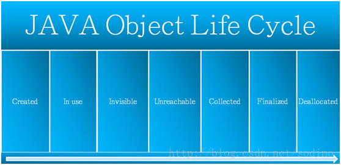

## 1. Java 面向对象编程三大特性: 封装 继承 多态

### 封装

是指隐藏对象的属性和实现细节，仅对外提供公共访问方式。
好处：将变化隔离；便于使用；提高重用性；安全性。
封装原则：将不需要对外提供的内容都隐藏起来，把属性都隐藏，提供公共方法对其访问。

### 继承

好处：
1. 提高了代码的复用性。
2. 让类与类之间产生了关系，提供了另一个特征多态的前提。
 
父类的由来：其实是由多个类不断向上抽取共性内容而来的。
java中对于继承，java只支持单继承。java虽然不直接支持多继承，但是保留了这种多继承机制，进行改良。

- 单继承：一个类只能有一个父类。
- 多继承：一个类可以有多个父类。

为什么不支持多继承呢？
>因为当一个类同时继承两个父类时，两个父类中有相同的功能，那么子类对象调用该功能时，运行哪一个呢？因为父类中的方法中存在方法体。
但是java支持多重继承。A继承B  B继承C  C继承D。
多重继承的出现，就有了继承体系。体系中的顶层父类是通过不断向上抽取而来的。它里面定义的该体系最基本最共性内容的功能。
所以，一个体系要想被使用，直接查阅该系统中的父类的功能即可知道该体系的基本用法。那么想要使用一个体系时，需要建立对象。建议建立最子类对象，因为最子类不仅可以使用父类中的功能。还可以使用子类特有的一些功能。

简单说：对于一个继承体系的使用，查阅顶层父类中的内容，创建最底层子类的对象。

### 多态

函数本身就具备多态性，某一种事物有不同的具体的体现。

- 体现：父类引用或者接口的引用指向了自己的子类对象。//Animal a = new Cat();
- 多态的好处：提高了程序的扩展性。
- 多态的弊端：当父类引用指向子类对象时，虽然提高了扩展性，但是只能访问父类中具备的方法，不可以访问子类中特有的方法。(前期不能使用后期产生的功能，即访问的局限性)
- 多态的前提：
	- 1：必须要有关系，比如继承、或者实现。
	- 2：通常会有覆盖操作。

	
## 2. Java对象的生命周期

Java对象在虚拟机上运行有7阶段：创建、应用、不可见、不可达、收集、终结、对象空间重新分配。


(1）创建阶段(Created)

创建Java对象阶段的具体步骤如下：<br/>
①　为对象分配存储空间；<br/>
②　构造对象；<br/>
③　从超类到子类对static成员进行初始化，类的static成员的初始化在ClassLoader加载该类时进行；<br/>
④　超类成员变量按顺序初始化，递归调用超类的构造方法；<br/>
⑤　子类成员变量按顺序初始化，一旦对象被创建，子类构造方法就调用该对象并为某些变量赋值，完成后这个对象的状态就切换到了应用阶段。

（2）应用阶段(InUse)

对象至少被一个强引用持有。除非在系统中显式地使用了软引用、弱引用或虚引用。

（3）不可见阶段(Invisible)

处于不可见阶段的对象在虚拟机的对象引用根集合中再也找不到直接或间接的强引用，这些对象一般是所有线程栈中的临时变量。所有已经装载的静态变量或是对本地代码接口的引用。

当一个对象处于不可见阶段时，说明程序本身不再持有该对象的任何强引用，虽然该对象仍然存在。该对象可能被虚拟机中的某些已装载的静态变量线程或JNI等强引用持有，这些特殊的强引用称为“GC Root”。存在这些GC Root会导致对象的内存泄漏，无法被回收。

（4）不可达阶段(Unreachable)

对象处于不可达阶段是指该对象不再被任何强引用持有，回收器发现该对象已经不可达。

（5）收集阶段(Collected)

当垃圾回收器发现该对象已经处于“不可达阶段”并且垃圾回收器已经对该对象的内存空间重新分配做好准备时，对象进入“收集阶段”。如果该对象已经重写了finalize()方法，则执行该方法的操作。

（6）终结阶段(Finalized)

当对象执行完finalize()方法后仍然处于不可达状态时，该对象进入终结阶段。在该阶段，等待垃圾回收器回收该对象空间。

（7）对象空间重新分配阶段(Deallocated)

若垃圾回收器对该对象占用的内存空间进行回收或者再分配，则该对象彻底消失，这个阶段称为“对象空间重新分配阶段”。

## 3. 抽象类和接口的区别

> 从设计层面来说，抽象是对类的抽象，是一种模板设计，接口是行为的抽象，是一种行为的规范。

### 抽象类与接口：
- 抽象类：一般用于描述一个体系单元，将一组共性内容进行抽取，特点：可以在类中定义抽象内容让子类实现，可以定义非抽象内容让子类直接使用。它里面定义的都是一些体系中的基本内容。
- 接口：一般用于定义对象的扩展功能，是在继承之外还需这个对象具备的一些功能。

抽象类和接口的共性：都是不断向上抽取的结果。

1. 接口的方法默认是public，所有方法在接口中不能有实现，抽象类可以有非抽象的方法
2. 接口中的实例变量默认是final类型的，而抽象类中则不一定
3. 一个类可以实现多个接口，但最多只能实现一个抽象类
4. 一个类实现接口的话要实现接口的所有方法，而抽象类不一定
5. 接口不能用new实例化，但可以声明，但是必须引用一个实现该接口的对象

## 常用关键字this、super、static和final

### this: 代表对象。就是所在函数所属对象的引用。

this到底代表什么呢？哪个对象调用了this所在的函数，this就代表哪个对象，就是哪个对象的引用。
开发时，什么时候使用this呢？
在定义功能时，如果该功能内部使用到了调用该功能的对象，这时就用this来表示这个对象。

this 还可以用于构造函数间的调用。
调用格式：this(实际参数)；
this对象后面跟上 .  调用的是成员属性和成员方法(一般方法)；
this对象后面跟上 () 调用的是本类中的对应参数的构造函数。

注意：用this调用构造函数，必须定义在构造函数的第一行。因为构造函数是用于初始化的，所以初始化动作一定要执行。否则编译失败。

### super关键字

super：代表是子类所属的父类中的内存空间引用。
	 注意：子父类中通常是不会出现同名成员变量的，因为父类中只要定义了，子类就不用在定义了，直接继承过来用就可以了。
	 
java中子类的所有构造函数中的第一行，其实都有一条隐身的语句super()，super(): 表示父类的构造函数，并会调用于参数相对应的父类中的构造函数。而super():是在调用父类中空参数的构造函数。


### static：关键字，是一个修饰符，用于修饰成员(成员变量和成员函数)。

特点：
- 1，想要实现对象中的共性数据的对象共享。可以将这个数据进行静态修饰。
- 2，被静态修饰的成员，可以直接被类名所调用。也就是说，静态的成员多了一种调用方式。类名.静态方式。
- 3，静态随着类的加载而加载。而且优先于对象存在。

弊端：
- 1，有些数据是对象特有的数据，是不可以被静态修饰的。因为那样的话，特有数据会变成对象的共享数据。这样对事物的描述就出了问题。所以，在定义静态时，必须要明确，这个数据是否是被对象所共享的。
- 2，静态方法只能访问静态成员，不可以访问非静态成员。
因为静态方法加载时，优先于对象存在，所以没有办法访问对象中的成员。
- 3，静态方法中不能使用this，super关键字。
因为this代表对象，而静态在时，有可能没有对象，所以this无法使用。

### 静态代码块：就是一个有静态关键字标示的一个代码块区域。定义在类中。
作用：可以完成类的初始化。静态代码块随着类的加载而执行，而且只执行一次（new 多个对象就只执行一次）。如果和主函数在同一类中，优先于主函数执行。

静态代码块、构造代码块、构造函数同时存在时的执行顺序：静态代码块 -> 构造代码块 -> 构造函数。

### final：关键字

在Java中，final关键字可以用来修饰类、方法和变量（包括成员变量和局部变量）。

- 修饰类

当用final修饰一个类时，表明这个类不能被继承。也就是说，如果一个类你永远不会让他被继承，就可以用final进行修饰。

- 修饰方法

下面这段话摘自《Java编程思想》第四版第143页：

　　“使用final方法的原因有两个。第一个原因是把方法锁定，以防任何继承类修改它的含义；第二个原因是效率。在早期的Java实现版本中，会将final方法转为内嵌调用。但是如果方法过于庞大，可能看不到内嵌调用带来的任何性能提升。在最近的Java版本中，不需要使用final方法进行这些优化了。“

　　因此，如果只有在想明确禁止 该方法在子类中被覆盖的情况下才将方法设置为final的。

注：类的private方法会隐式地被指定为final方法。

- 修饰变量

　　对于一个final变量，如果是基本数据类型的变量，则其数值一旦在初始化之后便不能更改；如果是引用类型的变量，则在对其初始化之后便不能再让其指向另一个对象。
　　
## 4. StringBuffer和StringBuilder的区别

1、StringBuffer 与 StringBuilder 中的方法和功能完全是等价的，

2、只是StringBuffer 中的方法大都采用了 synchronized 关键字进行修饰，因此是线程安全的，而 StringBuilder 没有这个修饰，可以被认为是线程不安全的。 

3、在单线程程序下，StringBuilder效率更快，因为它不需要加锁，不具备多线程安全，而StringBuffer则每次都需要判断锁，效率相对更低

- StringBuffer初始化及扩容机制

1.StringBuffer()的初始容量可以容纳16个字符，当该对象的实体存放的字符的长度大于16时，实体容量就自动增加。StringBuffer对象可以通过length()方法获取实体中存放的字符序列长度，通过capacity()方法来获取当前实体的实际容量。

2.StringBuffer(int size)可以指定分配给该对象的实体的初始容量参数为参数size指定的字符个数。当该对象的实体存放的字符序列的长度大于size个字符时，实体的容量就自动的增加。以便存放所增加的字符。

3.StringBuffer(String s)可以指定给对象的实体的初始容量为参数字符串s的长度额外再加16个字符。当该对象的实体存放的字符序列长度大于size个字符时，实体的容量自动的增加，以便存放所增加的字符。

## 5. Object类的equal和hashcode方法

因为hashCode()并不是完全可靠，有时候不同的对象他们生成的hashcode也会一样（生成hash值得公式可能存在的问题），所以hashCode()只能说是大部分时候可靠，并不是绝对可靠，所以我们可以得出：
- equal()相等的两个对象他们的hashCode()肯定相等，也就是用equal()对比是绝对可靠的。
- hashCode()相等的两个对象他们的equal()不一定相等，也就是hashCode()不是绝对可靠的。

boolean equals(Object obj)：用于比较两个对象是否相等，其实内部比较的就是两个对象地址。
而根据对象的属性不同，判断对象是否相同的具体内容也不一样。所以在定义类时，一般都会复写equals方法，建立本类特有的判断对象是否相同的依据。

int hashCode()：返回该对象的哈希码值。支持此方法是为了提高哈希表的性能。

### 6. hashCode（）与equals（）的相关规定
- 如果两个对象相等，则hashcode一定也是相同的
- 两个对象相等,对两个对象分别调用equals方法都返回true
- 两个对象有相同的hashcode值，它们也不一定是相等的
因此，equals 方法被覆盖过，则 hashCode 方法也必须被覆盖
- hashCode() 的默认行为是对堆上的对象产生独特值。如果没有重写 hashCode()，则该 class 的两个对象无论如何都不会相等（即使这两个对象指向相同的数据）
- 

### == 与 equals

**==** : 它的作用是判断两个对象的地址是不是相等。即，判断两个对象是不是同一个对象(“==”基本数据类型比较的是值，引用数据类型比较的是内存地址)。

**equals()** : 它的作用也是判断两个对象是否相等。但它一般有两种使用情况：
-  情况1：类没有覆盖 equals() 方法。则通过 equals() 比较该类的两个对象时，等价于通过“==”比较这两个对象。
- 情况2：类覆盖了 equals() 方法。一般，我们都覆盖 equals() 方法来两个对象的内容相等；若它们的内容相等，则返回 true (即，认为这两个对象相等)。
 
**举个例子：**

```java
public class test1 {
    public static void main(String[] args) {
        String a = new String("ab"); // a 为一个引用
        String b = new String("ab"); // b为另一个引用,对象的内容一样
        String aa = "ab"; // 放在常量池中
        String bb = "ab"; // 从常量池中查找
        if (aa == bb) // true
            System.out.println("aa==bb");
        if (a == b) // false，非同一对象
            System.out.println("a==b");
        if (a.equals(b)) // true
            System.out.println("aEQb");
        if (42 == 42.0) { // true
            System.out.println("true");
        }
    }
}
```

**说明：**
- String 中的 equals 方法是被重写过的，因为 object 的 equals 方法是比较的对象的内存地址，而 String 的 equals 方法比较的是对象的值。
- 当创建 String 类型的对象时，虚拟机会在常量池中查找有没有已经存在的值和要创建的值相同的对象，如果有就把它赋给当前引用。如果没有就在常量池中重新创建一个 String 对象。
