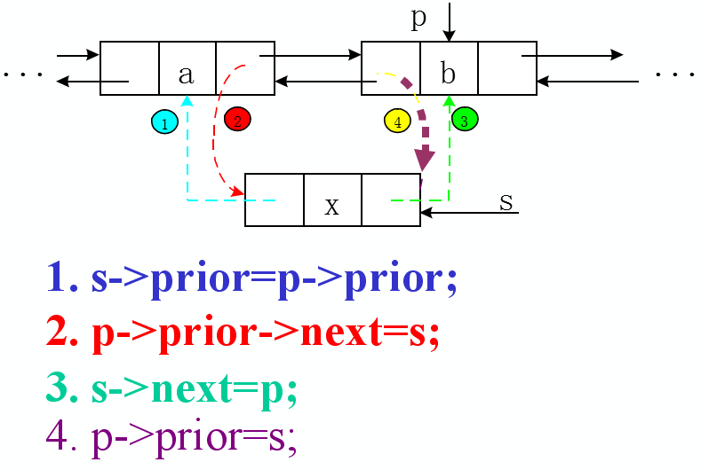
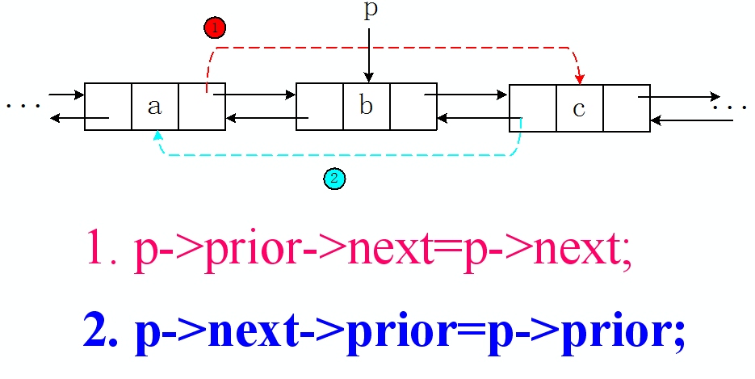

List代表一种线性表的数据结构，ArrayList则是一种顺序存储的线性表。ArrayList底层采用数组来保存每个集合的元素，LinkedList则是一种链式存储的线性表。其本质上就是一个双向链表，但它不仅实现了List接口，还是想了Deque接口。也就是说LinkedList既可以当成双向链表使用，也可以当成队列使用，还可以当成栈来适用于（Deque代表双端队列，即具有队列的特征，也具有栈的特征）。

在[从源码角度分析ArrayList和Vector的区别](./从源码角度分析ArrayList和Vector的区别.md)中已经分析过，ArrayList底层采用一个elementData数组来保存所有集合的元素，因此ArrayList在插入元素时需要完成下面两件事情。

- 保证ArrayList底层封装的数组长度大于集合元素的个数；
- 将插入位置之后的所有数组元素“整体搬家”，向后移动一“格”。

反过来，当删除ArrayList集合中指定的元素时，程序也需要“整体搬家”，而且还需要将被删除索引处的数组元素置为null。下面是ArrayList集合的remove(int idnex)方法的源码。

```java
     public E remove(int index) {
         //如果index是大于或者等于size，抛出异常
        rangeCheck(index);

        modCount++;
        //保存索引处的元素
        E oldValue = elementData(index);
        //计算需要“整体搬家”的元素个数
        int numMoved = size - index - 1;
        //当numMoved大于0时，开始搬家
        if (numMoved > 0)
            System.arraycopy(elementData, index+1, elementData, index,
                             numMoved);
        //释放被删除元素，以便GC回收该元素  
        elementData[--size] = null; // clear to let GC do its work

        return oldValue;
    }
```
 
 从上面的代码来看，对于ArrayList而言，当程序向ArrayList中添加、删除集合元素时，ArrayList底层都需要对数组进行“整体搬家”，因此性能比较差。

 但如果程序调用get(int index)方法来取出ArrayList集合中的元素时，性能和数据几乎相同--非常快。

```java
     public E get(int index) {
        rangeCheck(index);

        return elementData(index);
    }
```
  
LinkedList本质上是一个双向列表，因此它使用如下内部类来保存每个集合元素。
```java
    private static class Node<E> {
        //集合元素   
        E item;
        //保存指向下一个链表节点的引用
        Node<E> next;
        //保存指向上一个节点的引用
        Node<E> prev;
        //构造方法
        Node(Node<E> prev, E element, Node<E> next) {
            this.item = element;
            this.next = next;
            this.prev = prev;
        }
    }
```

由于LinkedList采用双向链表来保存集合元素，因此它在添加集合元素的时候，只需要对链表进行如下图所示的操作即可添加一个新节点。



```java
     public void add(int index, E element) {
        checkPositionIndex(index);

        //如果index==size，则直接在把新节点加在最后
        //否则，在index索引处的节点之前插入新节点
        if (index == size)
            linkLast(element);
        else
            linkBefore(element, node(index));
    }
```

从上面的代码可以看出，由于LinkedList本质上是一个双向链表，因此它可以非常方便地在指定节点之前插入新节点，LinkedList在指定位置添加新节点就是通过这种方式来实现的。
-  node(int index):搜索指定索引处的元素。
-  linkBefore(E e, Node<E> succ):在succ节点之前插入element新节点。

node(int index实际上就是get(int index)方法的底层实现。对于ArrayList来说，由于它底层采用数组来保存集合元素，因此可以直接根据数组索引取出index位置的元素；但是对于LinkedList就比较麻烦了，LinkedList必须要一个一个元素的搜索，直到找到第index个元素为止。

```java
      /**
     * Returns the (non-null) Node at the specified element index.
     */
     //获取指定索引处的节点
    Node<E> node(int index) {
        // assert isElementIndex(index);

        //从链表的头端开始搜索
        if (index < (size >> 1)) {
            Node<E> x = first;
            for (int i = 0; i < index; i++)
                x = x.next;
            return x;
        } else {
            //从链表的尾端开始搜索
            Node<E> x = last;
            for (int i = size - 1; i > index; i--)
                x = x.prev;
            return x;
        }
    }
```
上面的node(int index)方法就是一个元素一个元素地找到index索引处的元素，只是由于LinkedList是一个双向链表，因此先根据index的值判断它到底离链表的头端近（当index < (size >> 1)时），还是离链表的尾端近。如果离头端近则从头端开始搜索，如果离尾端近则从尾端开始搜索。

LinkedList的get(int index)方法只是对上面ode(int index)方法的简单包装。

 ```java
    /**
     * Returns the element at the specified position in this list.
     *
     * @param index index of the element to return
     * @return the element at the specified position in this list
     * @throws IndexOutOfBoundsException {@inheritDoc}
     */
    public E get(int index) {
        checkElementIndex(index);
        return node(index).item;
    }
```

无论如何，LinkedList为了获取指定索引处的元素都是比较麻烦的，系统开销也会比较大。但单纯的插入操作就比较简单了，只要修改几个简单离的previous、next引用的值。

 ```java
   /**
     * Inserts element e before non-null Node succ.
     */
     //在指定节点succ前添加一个新节点
    void linkBefore(E e, Node<E> succ) {
        // assert succ != null;
        final Node<E> pred = succ.prev;
        //创建新节点，新节点的下一个节点执行succ，上一个节点指向succ的上一个节点
        final Node<E> newNode = new Node<>(pred, e, succ);
        //让succ向前指向新节点
        succ.prev = newNode;
        if (pred == null)
            first = newNode;
        else
            //让succ的上一个节点向后指向新节点
            pred.next = newNode;
        size++;
        modCount++;
    }
```
  
  如果只是单纯地添加某个节点，LinkedList的性能会非常好，可惜如果需要向指定索引处添加节点，LinkedList必须先找到指定索引处的节点--这个搜索过程的系统开销并不小，因为LinkedList的add(int index,E element)方法的性能并不是特别好。

  > 当单纯地把LinkedList当成双向链表来使用，使用addFirst(E e)、addLast(E e)、offerFirst(E e)、offerLast(E e)、pollFirst()、pollLast等方法来操作LinkedList集合元素时，LinkedList的性能非常好。


  LinkedList中删除一个元素：



类似地，LinkedList为了实现remove(int index)方法，也必须通过node(int index)方法找到index处的节点，然后修改它前一个节点的next引用以及后一个节点previous引用。