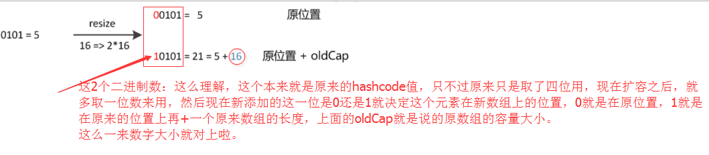

> 文章已同步发表于微信公众号JasonGaoH，[关于HashMap你需要知道的一些细节](https://mp.weixin.qq.com/s?__biz=MzUyNTE2OTAzMQ==&mid=2247483757&idx=1&sn=f8cf2e5f82b6cf0e64aab6febf7e7584&chksm=fa237985cd54f0937f9c3c2d3df40b1136602b00d253d2104452ef72319bae6ca7ffcc4f1183&token=1938879438&lang=zh_CN#rd)

在官方文档中的描述：
> Hash table based implementation of the Map interface. This implementation provides all of the optional map operations, and permits null values and the null key. (The HashMap class is roughly equivalent to Hashtable, except that it is unsynchronized and permits nulls.) This class makes no guarantees as to the order of the map; in particular, it does not guarantee that the order will remain constant over time.

> 基于Map接口的哈希表的实现。此实现提供所有可选的映射操作，并允许空值和空键。（HashMap类大致等同于HashTable，只是它不同步并且允许空值。）这个类不保证映射的顺序；特别是，它不保证顺序会随着时间的推移而保持不变。

### 两个重要的参数

在HashMap中有两个很重要的参数，容量(Capacity)和负载因子(Load factor)

> - Initial capacity The capacity is the number of buckets in the hash table, The initial capacity is simply the capacity at the time the hash table is created.
> - Load factor The load factor is a measure of how full the hash table is allowed to get before its capacity is automatically increased.

简单的说，Capacity就是buckets的数目，Load factor就是buckets填满程度的最大比例。如果对迭代性能要求很高的话不要把capacity设置过大，也不要把load factor设置过小。当bucket填充的数目（即hashmap中元素的个数）大于capacity*load factor时就需要调整buckets的数目为当前的2倍。

首先，我们来一起看看 HashMap 内部的结构，它可以看作是数组(Node[] table)和链表结 合组成的复合结构，数组被分为一个个桶(bucket)，通过哈希值决定了键值对在这个数组的寻址;哈希值相同的键值对，则以链表形式存储，你可以参考下面的示意图。这里需要注意的是，如果链表大小超过阈值(TREEIFY_THRESHOLD, 8)，图中的链表就会被改造为树形结构。


### put函数的实现
接着来看 put 方法实现:

put函数大致的思路为：

1. 对key的hashCode()做hash，然后再计算index;
2. 如果没碰撞直接放到bucket里；
3. 如果碰撞了，以链表的形式存在buckets后；
4. 如果碰撞导致链表过长(大于等于TREEIFY_THRESHOLD)，就把链表转换成红黑树；
5. 如果节点已经存在就替换old value(保证key的唯一性)
6. 如果bucket满了(超过load factor*current capacity)，就要resize。

```java
public V put(K key, V value) {
    // 对key的hashCode()做hash
    return putVal(hash(key), key, value, false, true);
}
final V putVal(int hash, K key, V value, boolean onlyIfAbsent,
               boolean evict) {
    Node<K,V>[] tab; Node<K,V> p; int n, i;
    // tab为空则创建
    if ((tab = table) == null || (n = tab.length) == 0)
        n = (tab = resize()).length;
    // 计算index，并对null做处理
    if ((p = tab[i = (n - 1) & hash]) == null)
        tab[i] = newNode(hash, key, value, null);
    else {
        Node<K,V> e; K k;
        // 节点存在
        if (p.hash == hash &&
            ((k = p.key) == key || (key != null && key.equals(k))))
            e = p;
        // 该链为树
        else if (p instanceof TreeNode)
            e = ((TreeNode<K,V>)p).putTreeVal(this, tab, hash, key, value);
        // 该链为链表
        else {
            for (int binCount = 0; ; ++binCount) {
                if ((e = p.next) == null) {
                    p.next = newNode(hash, key, value, null);
                    if (binCount >= TREEIFY_THRESHOLD - 1) // -1 for 1st
                        treeifyBin(tab, hash);
                    break;
                }
                if (e.hash == hash &&
                    ((k = e.key) == key || (key != null && key.equals(k))))
                    break;
                p = e;
            }
        }
        // 写入
        if (e != null) { // existing mapping for key
            V oldValue = e.value;
            if (!onlyIfAbsent || oldValue == null)
                e.value = value;
            afterNodeAccess(e);
            return oldValue;
        }
    }
    ++modCount;
    // 超过load factor*current capacity，resize
    if (++size > threshold)
        resize();
    afterNodeInsertion(evict);
    return null;
}
```

从 putVal 方法最初的几行，我们就可以发现几个有意思的地方:
- 如果表格是 null，resize 方法会负责初始化它，这从 tab = resize() 可以看出。
- resize 方法兼顾两个职责，创建初始存储表格，或者在容量不满足需求的时候，进行扩容 (resize)。
- 在放置新的键值对的过程中，如果发生下面条件，就会发生扩容。

```java
    if (++size > threshold)
    resize();
```
- 具体键值对在哈希表中的位置(数组 index)取决于下面的位运算:

```java
    i = (n - 1) & hash
```

仔细观察哈希值的源头，我们会发现，它并不是 key 本身的 hashCode，而是来自于 HashMap 内部的另外一个 hash 方法。注意，为什么这里需要将高位数据移位到低位进行异或运算呢?这是因为有些数据计算出的哈希值差异主要在高位，而 HashMap 里的哈希寻址是忽 略容量以上的高位的，那么这种处理就可以有效避免类似情况下的哈希碰撞。

```java
    static final int hash(Object kye) {
        int h;
        return (key == null) ? 0 : (h = key.hashCode()) ^ (h >>>16);
    }
```
- 我前面提到的链表结构(这里叫 bin)，会在达到一定门限值时，发生树化，我稍后会分析 为什么 HashMap 需要对 bin 进行处理。

可以看到，putVal 方法本身逻辑非常集中，从初始化、扩容到树化，全部都和它有关。

进一步分析一下身兼多职的 resize 方法，很多朋友都反馈经常被面试官追问它的源码设计。

```java
    
final Node<K,V>[] resize() {
    // ...
    else if ((newCap = oldCap << 1) < MAXIMUM_CAPACIY &&
                oldCap >= DEFAULT_INITIAL_CAPAITY)
        newThr = oldThr << 1; // double there
       // ...
    else if (oldThr > 0) // initial capacity was placed in threshold
        newCap = oldThr;
    else {
        // zero initial threshold signifies using defaultsfults newCap = DEFAULT_INITIAL_CAPAITY;
        newThr = (int)(DEFAULT_LOAD_ATOR* DEFAULT_INITIAL_CAPACITY;
    }
    if (newThr ==0) {
        float ft = (float)newCap * loadFator;
        newThr = (newCap < MAXIMUM_CAPACITY && ft < (float)MAXIMUM_CAPACITY ?(int)ft : Intege
    }
    threshold = neThr;
    Node<K,V>[] newTab = (Node<K,V>[])new Node[newap]; table = n;
    // 移动到新的数组结构 e 数组结构 }
```

依据 resize 源码，不考虑极端情况(容量理论最大极限由 MAXIMUM_CAPACITY 指定，数值 为 1<<30，也就是 2 的 30 次方)，我们可以归纳为:
- 门限值等于(负载因子)x(容量)，如果构建 HashMap 的时候没有指定它们，那么就是依 据相应的默认常量值。
- 门限通常是以倍数进行调整 (newThr = oldThr << 1)，我前面提到，根据 putVal 中的逻 辑，当元素个数超过门限大小时，则调整 Map 大小。
- 扩容后，需要将老的数组中的元素重新放置到新的数组，这是扩容的一个主要开销来源。


### 容量、负载因子
前面我们快速梳理了一下 HashMap 从创建到放入键值对的相关逻辑，现在思考一下，为什么 我们需要在乎容量和负载因子呢?

这是因为容量和负载系数决定了可用的桶的数量，空桶太多会浪费空间，如果使用的太满则会严
重影响操作的性能。极端情况下，假设只有一个桶，那么它就退化成了链表，完全不能提供所谓
常数时间存储的性能。
既然容量和负载因子这么重要，我们在实践中应该如何选择呢?

如果能够知道 HashMap 要存取的键值对数量，可以考虑预先设置合适的容量大小。具体数值 我们可以根据扩容发生的条件来做简单预估，根据前面的代码分析，我们知道它需要符合计算条件:

负载因子 * 容量 > 元素数量

所以，预先设置的容量需要满足，大于“预估元素数量 / 负载因子”，同时它是 2 的幂数，结论已经非常清晰了。

而对于负载因子，我建议:
- 如果没有特别需求，不要轻易进行更改，因为 JDK 自身的默认负载因子是非常符合通用场景的需求的。

- 如果确实需要调整，建议不要设置超过 0.75 的数值，因为会显著增加冲突，降低 HashMap 的性能。
- 如果使用太小的负载因子，按照上面的公式，预设容量值也进行调整，否则可能会导致更加
 频繁的扩容，增加无谓的开销，本身访问性能也会受影响。

### 树化改造
 我们前面提到了树化改造，对应逻辑主要在 putVal 和 treeifyBin 中。

 ```java
     final void treeifyBin(Node<K,V>[] tab, int hash) {
        int n, index; Node<K,V> e;
        if (tab == null || (n = tab.length) < MIN_TREEIFY_CAPACITY)
            resize();
        else if ((e = tab[index = (n - 1) & hash]) != null) {
            // 树化改造逻辑 
        }
    }
```

上面是精简过的 treeifyBin 示意，综合这两个方法，树化改造的逻辑就非常清晰了，可以理解为，当 bin 的数量大于 TREEIFY_THRESHOLD 时:
- 如果容量小于 MIN_TREEIFY_CAPACITY，只会进行简单的扩容。
- 如果容量大于 MIN_TREEIFY_CAPACITY ，则会进行树化改造。 

那么，为什么 HashMap 要树化呢?

本质上这是个安全问题。因为在元素放置过程中，如果一个对象哈希冲突，都被放置到同一个桶
里，则会形成一个链表，我们知道链表查询是线性的，会严重影响存取的性能。

### hash函数的实现
接着我们着重来看hash函数的实现：
```java
    static final int hash(Object kye) {
        int h;
        return (key == null) ? 0 : (h = key.hashCode()) ^ (h >>>16);
    }
```
这段代码实际上称为“扰动函数”，Java 8的代码相对Java 7是做过简化的，但原理是不变的。

我们都知道上面代码里的key.hashCode()函数调用的是key键值类型自带的哈希函数，返回int型散列值。

理论上hashCode是一个int值，这个int值范围在-2147483648和2147483648之间，如果直接拿这个hashCode作为HashMap中数组的下标来访问的话，正常情况下是不会出现hash碰撞的。
但是这样的话会导致这个HashMap的数组长度比较长，长度大概为40亿，内存肯定是放不下的，所以这个时候需要把这个hashCode对数组长度取余，用得到的余数来访问数组下标。

所以我们看到HashMap中get方法和put方法都有下面这样的代码：
```java
   tab[(n - 1) & hash]
```
(n-1)&hash实际上相当于hash%(n-1)取余数，但&计算速度更快。

这里我们举个例子：
以初始长度为16为例，16-1=15。2进制表示是00000000 00000000 00001111。
我们把15和某hashCode值做“与”操作如下，结果就是截取了最低的四位值。
```java
    10100101 11000100 00100101
&	00000000 00000000 00001111
----------------------------------
	00000000 00000000 00000101    //高位全部归零，只保留末四位
```
这样问题就来了，我们如果只是取低位的情况下，碰撞就会很严重。

这时候“扰动函数”的价值就体现出来了，我们来看下面这张图片：


右位移16位，正好是32bit的一半，自己的高半区和低半区做异或，就是为了混合原始哈希码的高位和低位，以此来加大低位的随机性。而且混合后的低位掺杂了高位的部分特征，这样高位的信息也被变相保留下来。

这样大多数的hashCode的分布已经很不错了，就算是发生了碰撞也用O(logn)的tree去做了。仅仅异或一下，既减少了系统的开销，也不会造成的因为高位没有参与下标的计算(table长度比较小时)，从而引起的碰撞。

以上就是关于HashMap中hash函数设计的原理。

### resize的实现原理

当put时，如果发现目前的bucket占用程度已经超过了Load Factor所希望的比例，那么就会发生resize。在resize的过程，简单的说就是把bucket扩充为2倍，之后重新计算index，把节点再放到新的bucket中。resize的注释是这样描述的：
> Initializes or doubles table size. If null, allocates in accord with initial capacity target held in field threshold. Otherwise, because we are using power-of-two expansion, the elements from each bin must either stay at same index, or move with a power of two offset in the new table.

大致意思就是说，当超过限制的时候会resize，然而又因为我们使用的是2次幂的扩展(指长度扩为原来2倍)，所以，元素的位置要么是在原位置，要么是在原位置再移动2次幂的位置。


我们来上面这张图，n为table的长度，图（a）表示扩容前的key1和key2两种key确定索引位置的示例，图（b）表示扩容后key1和key2两种key确定索引位置的示例，其中hash1是key1对应的哈希值(也就是根据key1算出来的hashcode值)与高位与运算的结果。

元素在重新计算hash之后，因为n变为2倍，那么n-1的mask范围在高位多1bit(红色)，因此新的index就会发生这样的变化：


 这样我们resize的时候，不需要像JDK1.7的实现那样重新计算hash，只需要看看原来的hash值新增的那个bit是1还是0就好了，是0的话索引没变，是1的话索引变成“原索引+oldCap。

 这个就是resize设计巧妙的地方，在扩容的时候，我们不需要重新去计算hash的值，元素的位置要么是在原位置，要么是在原位置再移动2次幂的位置。

### 参考文章
 [Java HashMap工作原理及实现](https://yikun.github.io/2015/04/01/Java-HashMap%E5%B7%A5%E4%BD%9C%E5%8E%9F%E7%90%86%E5%8F%8A%E5%AE%9E%E7%8E%B0/)

[HashMap 的 hash 方法原理](https://www.zhihu.com/question/20733617)

[HashMap的扩容机制](https://blog.csdn.net/u012961566/article/details/72963157)