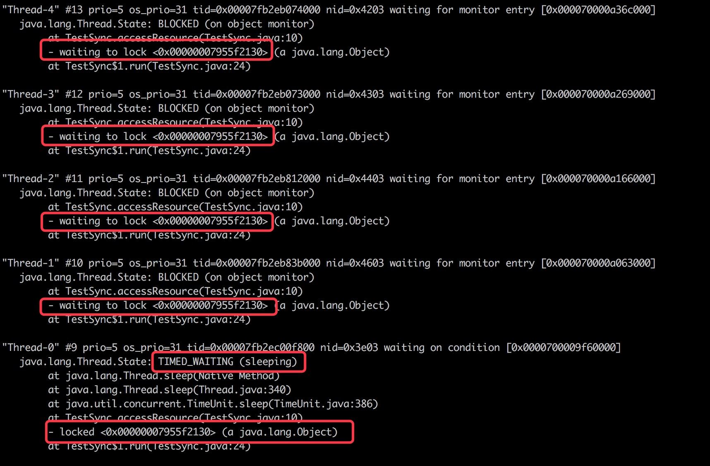

# synchronized关键字

### 什么是synchronized

JDK官网对synchronized关键字有个比较权威的解释。

Synchronized keyword enable a simple strategy for preventing thread interference and memory consistency errors: if an object is visible to more than one thread, all reads or writes to that object's variables ard done through synchronized methods.

上述解释的意思是：synchronized关键字可以实现一个简单的策略来防止线程干扰和内存一致性错误，如果一个对象对多个线程是可见的，那么对该对象的所有读或者写都将通过同步的方式来进行，具体表现如下：
- synchronized关键字提供了一种锁的机制，能够确保共享变量的互斥访问，从而防止数据不一致的问题出现。
- synchronized关键字包括monitor enter和monitor exit两个JVM指令，它能够保证在任何时候任何线程执行到monitor enter成功之前都必须从主内存中获取数据，而不是缓存中，在monitor exit运行成功之后，共享变量被更新后的值必须刷入主内存。
- synchronized的执行严格遵守java happens-before 规则，一个monitor exit指令之前必定要有一个monitor enter。

### synchronized关键字的用法
synchronized可以用于对代码块或方法进行修饰，而不能够用于对class以及变量进行修饰。

- 同步方法

```
public synchronized void sync() {
    //...
}
```
- 同步方法块

```
private final Object lock = new Object();
public void sync() {
    synchronized(lock) {
        //...
    }
}
```

关于同步代码块和同步方法的区别之前写过一个关于这个对比，具体可以看这篇文章。
[java中的synchronized（同步代码块和同步方法的区别）](https://blog.csdn.net/h_gao/article/details/52266950)

### 深入分析Synchronized关键字

#### 线程堆栈分析
synchronized关键字提供了一种互斥机制，也就是说在同一时刻，只能有一个线程访问同步资源。

看下面这段程序：
```
import java.util.concurrent.TimeUnit;

public class TestSync {
	
	private final static Object lock = new Object();
	
	public void accessResource() {
		synchronized(lock) {
			try {
				TimeUnit.MINUTES.sleep(10);
			} catch (InterruptedException e) {
				e.printStackTrace();
			}
		}
	}
	public static void main(String[] args) {
		final TestSync sync = new TestSync();
		for(int i =0;i<5;i++) {
			new Thread(){
				@Override
				public void run() {
					sync.accessResource();
				}	
			}.start();
		}
	}
}

```

上面的代码定义一个方法accessResource，并且使用synchronized来对代码进行同步，同时定义了5个线程调用accessResource方法，由于synchronized的互斥性，只能有一个线程获得lock的monitor锁，其他线程只能进入阻塞状态，等待获取lock的monitor锁。

针对这个monitor锁我们如何从线程堆栈信息来看呢？

其实，jstack命令在Java中可以用来打印进程的线程堆栈信息。

我们来运行这个Java程序，在终端通过top命令查看运行起来的Java程序的进程id，然后执行jstack ‘pid’。

我们来看下打印出来的信息：


通过截图可以看到Thread-0持有monitor<0x00000007955f2130>的锁并且处于休眠状态中，而其他几个线程则是处于BLOCKED状态中，它们是在等待着获取monitor<0x00000007955f2130>的锁。

#### JVM指令分析
从JVM指令角度再来分析synchronized关键字。

我们可以使用javap这个命令来对上面这个TestSync类生成的class字节码进行反编译，得到下面的JVM指令。
```
Compiled from "TestSync.java"
public class main.TestSync {
  static {};
    Code:
       0: new           #3                  // class java/lang/Object
       3: dup
       4: invokespecial #10                 // Method java/lang/Object."<init>":()V
       7: putstatic     #13                 // Field lock:Ljava/lang/Object;
      10: return

  public main.TestSync();
    Code:
       0: aload_0
       1: invokespecial #10                 // Method java/lang/Object."<init>":()V
       4: return

  public void accessResource();
    Code:
       0: getstatic     #13                 // Field lock:Ljava/lang/Object;
       3: dup
       4: astore_1
       5: monitorenter
       6: getstatic     #20                 // Field java/util/concurrent/TimeUnit.MINUTES:Ljava/util/concurrent/TimeUnit;
       9: ldc2_w        #26                 // long 10l
      12: invokevirtual #28                 // Method java/util/concurrent/TimeUnit.sleep:(J)V
      15: goto          23
      18: astore_2
      19: aload_2
      20: invokevirtual #32                 // Method java/lang/InterruptedException.printStackTrace:()V
      23: aload_1
      24: monitorexit
      25: goto          31
      28: aload_1
      29: monitorexit
      30: athrow
      31: return
    Exception table:
       from    to  target type
           6    15    18   Class java/lang/InterruptedException
           6    25    28   any
          28    30    28   any

  public static void main(java.lang.String[]);
    Code:
       0: new           #1                  // class main/TestSync
       3: dup
       4: invokespecial #44                 // Method "<init>":()V
       7: astore_1
       8: iconst_0
       9: istore_2
      10: goto          27
      13: new           #45                 // class main/TestSync$1
      16: dup
      17: aload_1
      18: invokespecial #47                 // Method main/TestSync$1."<init>":(Lmain/TestSync;)V
      21: invokevirtual #50                 // Method main/TestSync$1.start:()V
      24: iinc          2, 1
      27: iload_2
      28: iconst_5
      29: if_icmplt     13
      32: return
}
```

从上面的指令中可以看到，在accessResource()方法中，先后出现了一个monitor enter和两个monitor exit。

我们主要选取accessResource()这部分代码块来重点分析。
```
public void accessResource();
    Code:
       0: getstatic     #13                 //①获取lock
       3: dup
       4: astore_1
       5: monitorenter                      //②执行monitorenter JVM指令
       6: getstatic     #20                 // Field java/util/concurrent/TimeUnit.MINUTES:Ljava/util/concurrent/TimeUnit;
       9: ldc2_w        #26                 // long 10l
      12: invokevirtual #28                 // Method java/util/concurrent/TimeUnit.sleep:(J)V
      15: goto          23                  //③跳转到23行
      18: astore_2
      19: aload_2
      20: invokevirtual #32                 // Method java/lang/InterruptedException.printStackTrace:()V
      23: aload_1                           //④
      24: monitorexit                       //⑤ 执行monitor exit JVM指令
      25: goto          31
      28: aload_1
      29: monitorexit
      30: athrow
      31: return
```

首先①获取到lock引用，然后执行②monitorenter JVM指令，休眠结束后goto至③monitorexit的位置
（astore_n表示存储引用到本地变量表；aload_n表示从本地变量表加载应用；getstatic表示从class中获取静态属性）

monitorenter

 > 每一个对象都与一个monitor相关联，一个monitor的lock的锁只能被一个线程在同一时间获得，在一个线程尝试获得与对象关联的monitor的所有权时会发生如下的几件事情。

 - 如果monitor的计数器为0，则意味着该monitor的lock还没有被获得，，某个线程获得之后将立即对该计数器加一，从此该线程就是这个monitor的所有者了。
 - 如果一个已经拥有该线程所有权的线程重入，则会导致monitor的计数器再次累加。
 - 如果monitor已经被其他线程所拥有，则其他线程尝试获取该monitor所有权时，会被陷入阻塞状态直到monitor变为0，才能再次尝试获取对monitor的所有权。

monitorexit

释放对monitor的所有权，想要释放某个对象关联的monitor所有权的前提是，你曾经拥有了所有权。释放monitor所有权的过程比较简单，就是将monitor的计数器减一，如果计数器的结果为0，则意味着该线程不在拥有对该monitor的所有权，通俗地讲就是解锁。