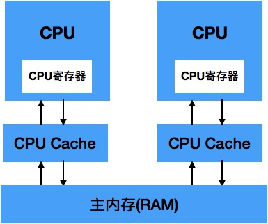

# volatile关键字

volatile是一个非常重要的关键字，虽然看起来很简单，但是想要彻底弄清楚volatile的来龙去脉还是需要具备Java内存模型、CPU缓存模型等知识的，我们尝试一步步地来深入地分析下volatile关键字工作原理。

#### volatile关键字使用
首先我们还是从代码来入手：
```

import java.util.concurrent.TimeUnit;

public class VolatileFoo {
	
	//init_value的最大值
	final static int MAX = 5;
	//init_value的初始值
	static int  init_value = 0;

	public static void main(String[] args) {
		//启动一个Reader线程，当发现local_value和init_value不同时，
		//则输出init_value被修改的信息
		new Thread("Readder"){
			@Override
			public void run() {
				int localValue = init_value;
				while(localValue < MAX) {
					if(init_value != localValue) {
						System.out.println("this init_value is updated to " + init_value);
						//对local_value重新赋值
						localValue = init_value;
					}
				}
			}
			
		}.start();
		
		new Thread("Updater") {
			public void run() {
				int localValue = init_value;
				while(localValue < MAX) {
					System.out.println("this init_value will be changed to " + ++localValue);
					//对local_value重新赋值
					init_value = localValue;
					try {
                        //短暂休眠，目的是为了使Reader线程能够来得及输出变化内容
						TimeUnit.SECONDS.sleep(2);
					} catch (InterruptedException e) {
						e.printStackTrace();
					}
				}
			};
		}.start();
	}
}
```
上面的程序分别启动了两个线程，一个线程负责对变量进行修改，一个线程负责对变量进行输出，该变量是属于共享资源（数据），在多线程操作的情况下，很有可能会引起数据不一致等线程安全的问题。

运行上面的程序，输出如下：
```
this init_value will be changed to 1
this init_value will be changed to 2
this init_value will be changed to 3
this init_value will be changed to 4
this init_value will be changed to 5
```
从输出信息我们发现，Reader线程没有感知到init_value的变化，我们期望的是在Updater进程更新init_value的值之后，Reader进程能够打印出变化的init_value的值，但结果并不是我们期望的那样。

接下来我们做个小小的改动：
```
static volatile int  init_value = 0;

```
我们使用volatile来修饰这个init_value的值。再次运行修改后的程序，输出结果如下：
```
this init_value will be changed to 1
this init_value is updated to 1
this init_value will be changed to 2
this init_value is updated to 2
this init_value will be changed to 3
this init_value is updated to 3
this init_value will be changed to 4
this init_value is updated to 4
this init_value will be changed to 5
this init_value is updated to 5
```
这个时候Reader线程就能够感受到init_value的值的变化了，并且在条件不满足时就退出了运行。

那么为什么加了个volatile就正常了呢， volatile关键字的作用到底是什么呢？

接下来我们一步一步来拆解问题。

#### CPU缓存模型
要想对volatile有比较深刻的理解，首先我们需要对CPU的缓存模型有一定的认识。

在计算机中，所有的运算操作都是由CPU的寄存器来完成的，CPU指令的执行过程需要设计数据的读取和写入操作，CPU所能访问的所有数据只能是计算机的贮存（通常是指RAM），虽然CPU的发现频率不断得到提升，但受制于制造工艺以及成本的限制，计算机的内存反倒在访问速度上没有多大的突破，因此CPU的处理速度和内存的访问速度之间的差距越拉越大，通常这种差距可以达到上千倍，极端情况下甚至会在上万倍以上。

由于两边速度严重的不对等，通过传统FSB直接内存的访问方式会导致CPU资源受到极大的限制，降低CPU整体的吞吐量，于是就有了CPU和主内存直接增加缓存的设计，现在缓存数量都可以增加到3级了，最靠近CPU的缓存为L1,ranhou依次是L2,L3和主内存，CPU缓存模型图如下所示：


Cache的出现是为了解决CPU直接访问内存效率低下的问题，程序在运行的过程中，会将运算所需要的数据从主内存复制一份到CPU Cache中，这样CPU计算时就可以直接怼CPU Cache中的数据进行读取和写入，当运算结束之后，再将CPU Cache中最新的数据刷新到主内存当中，CPU通过直接访问Cache的方式提到直接访问主内存的方式极大地提高了CPU的吞吐能力，有个CPU Cache之后，整体的CPU和主内存之间的交互的架构大致如下图所示：



#### Java内存模型

Java内存模型指定了Java虚拟机如何与计算机的内存进行工作，理解Java内存模型对于立即并发的原理是非常重要的。

Java的内存模型决定了一个线程对共享变量的写入何时对其他线程可见，Java内存模型定义了线程和主内存之间的抽象关系，具体如下。
- 共享变量存储于主内存之中，每个线程都可以访问。
- 每个线程都有私有的工作内存和本地内存。
- 工作内存值存储该线程对共享变量的副本。
- 线程不能直接操作主内存，只有先操作了工作内存之后才能写入主内存。
- 工作内存和Java内存模型一样也是一个抽象的概念，它其实并不存在，它涵盖了缓存、寄存器、编译优化以及硬件等。


Java内存模型是一个抽象的概念，其与计算机硬件的结构并不完全一样，比如计算机物理内存不会存在栈内存和堆内存的划分，无论是堆内存还是虚拟机栈内存都会对应到物理的主内存，当然也有一部分堆栈内存数据可能会存入CPU Cache寄存器中。具体可参考下图：


当同一个数据被分别存储到了计算机的各个内存区域时，势必会导致多个线程在各个的工作区域中看到的数据可能不一样的，这样就会引起所谓的线程安全问题。

#### 并发编程的三个重要特性
并发线程有三个至关重要的特性，分别是原子性、有序性和可见性，理解这三个特性对于开发正确的高并发程序会有很大的帮助。

#### 原子性
所谓原子性是指在一次的操作或者多次操作中，要么所有的操作全部得到了执行并且不会受到任何因素的干扰而中断，那么所有的操作都不执行。

两个原子性的操作结合在一起未必是原子性的，比如i++(其中get i，i+1和set i= x三者皆是原子性操作，但是不代表i++就是原子性操作)。

volatile关键字不保证数据的原子性，synchronized关键字保证，自JDK1.5版本起，其提供的原子类型变量也可以保证原子性。

#### 可见性
可见性是指，当一个线程对共享变量进行了修改，那么另外的线程可以立即看到修改后的最新值。

#### 有序性

所谓有序性是指程序代码在执行过程中的先后顺序，由于Java在编译器以及运行期的优化，导致了代码的执行顺序未必就是开发者编写代码时的顺序。

一般来说，处理器为了提高程序的运行效率，可能会对输入的代码指令做一定的优化，它不会百分之百的保证代码的执行顺序严格按照编写代码中的顺序来执行，但是它会保证程序的最终运行结果是编码时所期望的那样。

JVM内存模型的机制来屏蔽各个平台和操作系统之间内存访问的差异，以实现Java程序在各种平台下达到一致的内存访问效果。Java的内存模型规定了所有的变量都是存在于主内存中，而没给线程都有自己的工作内存或者本地内存，线程对变量的操作都补鞥呢访问其他线程的工作内存或者本地内存。

在Java语言中，对基本数据类型的变量读取赋值操作都是原子性的，对引用类型变量读取和赋值也是原子性的。Java内存模型只保证了基本读取和赋值的原子性操作，其他的均不保证，如果想要是的某些代码片段具备原子性，需要使用synchronized，或者JUC中的lock。如果想要是的int等类型自增操作具备原子性。可以使用JUC包下的原子封装类型java.util.concurrent.atomic.*

volatile关键字不具备保证原子性的操作。

在多线程的环境下，如果某个线程首次读取共享变量，则首先到主内存中读取该变量，然后存入工作内存中，以后只需要在写工作内存中读取该变量即可。同样如果对该变量执行了修改的，则现将新值写入工作内存中，然后再刷新到主内存中。

### volatile的两层语义
一旦一个共享变量（类的成员变量、 类的静态成员变量） 被 volatile 修饰之后， 那么就具备了两层语义：

- 保证了不同线程对这个变量进行读取时的可见性， 即一个线程修改了某个变量的值， 这新值对其他线程来说是立即可见的。 (volatile 解决了线程间共享变量的可见性问题)。
- 禁止进行指令重排序， 阻止编译器对代码的优化。

#### volatile如何实现可见性
- 第一： 使用 volatile 关键字会强制将修改的值立即写入主存；
- 第二： 使用 volatile 关键字的话， 当线程 2 进行修改时， 会导致线程 1 的工作内存中缓存变量 stop 的缓存行无效（反映到硬件层的话， 就是 CPU 的 L1或者 L2 缓存中对应的缓存行无效);
- 第三： 由于线程 1 的工作内存中缓存变量 stop 的缓存行无效， 所以线程 1再次读取变量 stop 的值时会去主存读取。

#### volatile禁止重排序

volatile 关键字禁止指令重排序有两层意思：
- 当程序执行到 volatile 变量的读操作或者写操作时， 在其前面的操作的更改肯定全部已经进行， 且结果已经对后面的操作可见； 在其后面的操作肯定还没有进行
- 在进行指令优化时， 不能把 volatile 变量前面的语句放在其后面执行，也不能把 volatile 变量后面的语句放到其前面执行。


#### volatile关键字深入解析

被volatile修饰的变量或者类变量具备如下两层含义。
- 保证了不同线程之间对共享癌变了操作时的可见性，也就是说当一个线程修改volatil修饰的变量，另外一个线程会立刻看到最新的值。
- 进行对执行进行重排序操作。

volatile关键字可以保证可见性以及顺序性，那么它到底是如何做到的呢？

Java中提供UnSafe这样的一个类 ，UnSafe提供了硬件级别的原子操作，提高了Java对底层操作的能力。

通过对OpenJDK下的unsafe.cpp源码的阅读，会发现被volatile修饰的变量存在于一个“lock;”,源码如下：
```
//Adding a lock prefix to an instruction on MP machine
 define LOCKIF_MP（mp）＂cmp $0，＂＃mp＂， je 1f: lock；1:＂
 ...
 inline jint Atomic: cmpxchg（jint exchange_value， volatile jint＊ dest， lats. compare_value）｛
    int mp＝ os:: is MP（）
    asmvolatile（LOCK_IF_MP（84） ＂cmpxchgl %1，（%3）＂
            :＂＝a＂（exchange value）
            :＂r＂（exchange_value）,"a"（compare_value），＂r＂（dest）.＂r＂(mp)
            :＂cc＂，＂memory）i;
    return exchange value；
 }
```

这个“lock;”前缀实际上相当于是一个内存屏障，该内存屏障会为指令的执行提供如下几个保障。
- 确保指令重排序时不会将其他后面的代码排到内存屏障之前。
- 确保指令重排时不会将其前面的代码排到内存屏障之后。
- 确保执行到内存屏障的指令时前面的代码全部执行完成。
- 强制将线程工作内存中值得修改刷新至主内存中。
- 如果是写操作，则会导致其他线程工作内存（CPU Cache）中的缓存数据失效。

> 总结来说，内存屏障有两个作用：
> 先于这个内存屏障的指令必须先执行， 后于这个内存屏障的指令必须后执行。
> 如果你的字段是volatile，在读指令前插入读屏障，可以让高速缓存中的数据失效，重新从主内存加载数据。在写指令之后插入写屏障，能让写入缓存的最新数据写回到主内存。