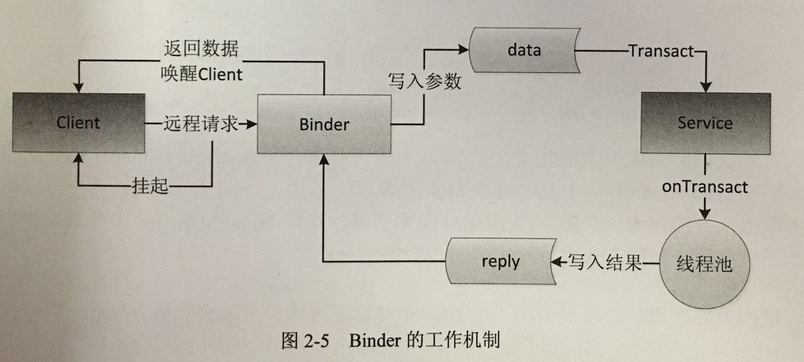

# Android进程间通信--Binder

Binder工作机制:<br>
从Android应用层来说，Binder是客户端和服务端进行通信的媒介。<br>
当bindService()的时候，服务端会返回一个包含了服务端业务调用的Binder对象，通过这个Binder对象，客户端就可以获取服务端的服务或者数据，这里的服务包括普通服务和AIDL服务。<br>
Android开发中，Binder主要用在Service中，包括AIDL和Messenger。其中普通Service中的Binder不涉及进程间通信，较为简单，无法触及Binder的核心。而Messenger得底层其实是AIDL，所以AIDL的实现原理，即是Binder在Android应用层的原理。
     


注意：<br>
Client和Server处在不同进程，才走AIDL的transact()过程。该逻辑由AIDL#Stub的内部代理类Proxy来完成。<br>
transact()方法运行在服务端的Binder线程池中，当客户端发起跨进程请求时，远程请求会通过系统底层封装后交由此方法处理。<br>
服务端通过"code"(代表方法或服务)可以确定客户端请求什么。接着从"data"取出目标方法的参数，然后执行目标方法。<br>
目标方法执行完毕后，就向目标方法写入返回值。过程即是这样。<br>
需要注意的是，该方法返回false，客户端会请求失败。所以可以利用此特性做权限验证，避免任何进程都可以远程调用我们的服务。

Client: 

```
/**
 * Binder机制demo
 *
 * Client: ClientActivity, Server: NewsService
 *
 * 通过AIDL传递数据NewsBean，本质原理还是Binder机制。
 */
public class ClientActivity extends AppCompatActivity {

    private INewsAIDL mNewsAIDL;

    private ServiceConnection mServiceConnection = new ServiceConnection() {
        @Override
        public void onServiceConnected(ComponentName name, IBinder service) {
            mNewsAIDL = INewsAIDL.Stub.asInterface(service);
            try {
                NewsBean news = mNewsAIDL.getNewsBean();
                Log.d("aidl", "Client: onServiceConnected , " + news.describe);
            } catch (RemoteException e) {
                e.printStackTrace();
            }
        }

        @Override
        public void onServiceDisconnected(ComponentName name) {

        }
    };

    @Override
    protected void onCreate(Bundle savedInstanceState) {
        super.onCreate(savedInstanceState);
        setContentView(R.layout.activity_client);
		
		// 启动远程服务
        bindService(new Intent(this, NewsService.class),
                mServiceConnection,
                Context.BIND_AUTO_CREATE);
    }
}
```

启动Client，输出：

```
Client进程：
Client: onServiceConnected , Hello from server!

Server进程：
Server: onCreate
Server: onBind
```

Server：

```
public class NewsService extends Service {

    private NewsBean newsBean;

    private INewsAIDL.Stub mBinder = new INewsAIDL.Stub() {
        @Override
        public NewsBean getNewsBean() throws RemoteException {
            return newsBean;
        }

        @Override
        public void setNewsDescription(String description) throws RemoteException {
            newsBean.describe = "News modified by server!";
        }
    };

    @Override
    public void onCreate() {
        super.onCreate();
        Log.d("aidl", "Server: onCreate");
        newsBean = new NewsBean("Hello from server!");
    }

    @Override
    public IBinder onBind(Intent intent) {
        Log.d("aidl", "Server: onBind");
        return mBinder;
    }
}
```

传输的数据：

```
public class NewsBean implements Parcelable {

    public String describe;

    public NewsBean(String describe) {
        this.describe = describe;
    }

    public NewsBean(Parcel in) {
        describe = in.readString();
    }

    @Override
    public int describeContents() {
        return 0;
    }

    @Override
    public void writeToParcel(Parcel dest, int flags) {
        dest.writeString(describe);
    }

    public static final Parcelable.Creator<NewsBean> CREATOR =
            new Parcelable.Creator<NewsBean>() {
                @Override
                public NewsBean createFromParcel(Parcel source) {
                    return new NewsBean(source);
                }

                @Override
                public NewsBean[] newArray(int size) {
                    return new NewsBean[size];
                }
            };
}
```

定义数据及服务的AIDL：

数据AIDL NewsBean.aidl

```
parcelable NewsBean;
```

服务AIDL INewsAIDL.aidl

```
import ***.NewsBean;

interface INewsAIDL {

    NewsBean getNewsBean();

    void setNewsDescription(String description);
}
```

服务AIDL编译生成的文件：

```
public interface INewsAIDL extends android.os.IInterface {
    /**
     * Local-side IPC implementation stub class.
     */
    public static abstract class Stub extends android.os.Binder implements com.example.ninghai.myapplication.binder.INewsAIDL {
        private static final java.lang.String DESCRIPTOR = "com.example.ninghai.myapplication.binder.INewsAIDL";

        /**
         * Construct the stub at attach it to the interface.
         */
        public Stub() {
            this.attachInterface(this, DESCRIPTOR);
        }

        /**
         * Cast an IBinder object into an com.example.ninghai.myapplication.binder.INewsAIDL interface,
         * generating a proxy if needed.
         */
        public static com.example.ninghai.myapplication.binder.INewsAIDL asInterface(android.os.IBinder obj) {
            if ((obj == null)) {
                return null;
            }
            android.os.IInterface iin = obj.queryLocalInterface(DESCRIPTOR);
            if (((iin != null) && (iin instanceof com.example.ninghai.myapplication.binder.INewsAIDL))) {
                return ((com.example.ninghai.myapplication.binder.INewsAIDL) iin);
            }
            return new com.example.ninghai.myapplication.binder.INewsAIDL.Stub.Proxy(obj);
        }

        @Override
        public android.os.IBinder asBinder() {
            return this;
        }

        @Override
        public boolean onTransact(int code, android.os.Parcel data, android.os.Parcel reply, int flags) throws android.os.RemoteException {
            switch (code) {
                case INTERFACE_TRANSACTION: {
                    reply.writeString(DESCRIPTOR);
                    return true;
                }
                case TRANSACTION_getNewsBean: {
                    data.enforceInterface(DESCRIPTOR);
                    com.example.ninghai.myapplication.binder.NewsBean _result = this.getNewsBean();
                    reply.writeNoException();
                    if ((_result != null)) {
                        reply.writeInt(1);
                        _result.writeToParcel(reply, android.os.Parcelable.PARCELABLE_WRITE_RETURN_VALUE);
                    } else {
                        reply.writeInt(0);
                    }
                    return true;
                }
                case TRANSACTION_setNewsDescription: {
                    data.enforceInterface(DESCRIPTOR);
                    java.lang.String _arg0;
                    _arg0 = data.readString();
                    this.setNewsDescription(_arg0);
                    reply.writeNoException();
                    return true;
                }
            }
            return super.onTransact(code, data, reply, flags);
        }

        private static class Proxy implements com.example.ninghai.myapplication.binder.INewsAIDL {
            private android.os.IBinder mRemote;

            Proxy(android.os.IBinder remote) {
                mRemote = remote;
            }

            @Override
            public android.os.IBinder asBinder() {
                return mRemote;
            }

            public java.lang.String getInterfaceDescriptor() {
                return DESCRIPTOR;
            }

            @Override
            public com.example.ninghai.myapplication.binder.NewsBean getNewsBean() throws android.os.RemoteException {
                android.os.Parcel _data = android.os.Parcel.obtain();
                android.os.Parcel _reply = android.os.Parcel.obtain();
                com.example.ninghai.myapplication.binder.NewsBean _result;
                try {
                    _data.writeInterfaceToken(DESCRIPTOR);
                    mRemote.transact(Stub.TRANSACTION_getNewsBean, _data, _reply, 0);
                    _reply.readException();
                    if ((0 != _reply.readInt())) {
                        _result = com.example.ninghai.myapplication.binder.NewsBean.CREATOR.createFromParcel(_reply);
                    } else {
                        _result = null;
                    }
                } finally {
                    _reply.recycle();
                    _data.recycle();
                }
                return _result;
            }

            @Override
            public void setNewsDescription(java.lang.String description) throws android.os.RemoteException {
                android.os.Parcel _data = android.os.Parcel.obtain();
                android.os.Parcel _reply = android.os.Parcel.obtain();
                try {
                    _data.writeInterfaceToken(DESCRIPTOR);
                    _data.writeString(description);
                    mRemote.transact(Stub.TRANSACTION_setNewsDescription, _data, _reply, 0);
                    _reply.readException();
                } finally {
                    _reply.recycle();
                    _data.recycle();
                }
            }
        }

        static final int TRANSACTION_getNewsBean = (android.os.IBinder.FIRST_CALL_TRANSACTION + 0);
        static final int TRANSACTION_setNewsDescription = (android.os.IBinder.FIRST_CALL_TRANSACTION + 1);
    }

    public com.example.ninghai.myapplication.binder.NewsBean getNewsBean() throws android.os.RemoteException;

    public void setNewsDescription(java.lang.String description) throws android.os.RemoteException;
}
```


IBookManager.java

此文件是系统根据IBookManager.aidl自动生成。

```
package com.utils.myapplication.service.aidl;

public interface IBookManager extends android.os.IInterface {

    public static abstract class Stub extends android.os.Binder implements com.***.aidl.IBookManager {
    
    	// Binder的唯一标识，一般用当前Binder类名表示
        private static final java.lang.String DESCRIPTOR = "com.utils.myapplication.service.aidl.IBookManager";

        public Stub() {
            this.attachInterface(this, DESCRIPTOR);
        }

        // 将服务端Binder对象转换成客户端所需的AIDL接口类型的对象
        // 这种转换区分进程：客户端服务端位于同一进程，该方法返回服务端Stub本身，否则返回系统封装后的Stub.Proxy对象
        
        public static com.utils.myapplication.service.aidl.IBookManager asInterface(android.os.IBinder obj) {
            if ((obj == null)) {
                return null;
            }
            android.os.IInterface iin = obj.queryLocalInterface(DESCRIPTOR);
            if (((iin != null) && (iin instanceof com.utils.myapplication.service.aidl.IBookManager))) {
                return ((com.utils.myapplication.service.aidl.IBookManager) iin);
            }
            return new com.utils.myapplication.service.aidl.IBookManager.Stub.Proxy(obj);
        }

		// 返回当前Binder对象		
        @Override
        public android.os.IBinder asBinder() {
            return this;
        }

		// Client和Server处在不同进程，才走transact过程。该逻辑由Stub内部代理类Proxy完成
		// 此方法运行在服务端的Binder线程池中，当客户端发起跨进程请求时，远程请求会通过系统底层封装后交由此方法处理
		// 服务端通过"code"可以确定客户端请求什么。接着从"data"取出目标方法的参数，然后执行目标方法
		// 目标方法执行完毕后，就向目标方法写入返回值。过程即是这样。
		// 需要注意的是，该方法返回false，客户端会请求失败。所以可以利用此特性做权限验证，避免任何进程都可以远程调用我们的服务。
		
        @Override
        public boolean onTransact(int code, android.os.Parcel data, android.os.Parcel reply, int flags) throws android.os.RemoteException {
            switch (code) {
                case INTERFACE_TRANSACTION: {
                    reply.writeString(DESCRIPTOR);
                    return true;
                }
                case TRANSACTION_getBookList: {
                    data.enforceInterface(DESCRIPTOR);
                    java.util.List<com.utils.myapplication.service.aidl.Book> _result = this.getBookList();
                    reply.writeNoException();
                    reply.writeTypedList(_result);
                    return true;
                }
                case TRANSACTION_addBook: {
                    data.enforceInterface(DESCRIPTOR);
                    com.utils.myapplication.service.aidl.Book _arg0;
                    if ((0 != data.readInt())) {
                        _arg0 = com.utils.myapplication.service.aidl.Book.CREATOR.createFromParcel(data);
                    } else {
                        _arg0 = null;
                    }
                    this.addBook(_arg0);
                    reply.writeNoException();
                    return true;
                }
            }
            return super.onTransact(code, data, reply, flags);
        }


		// Proxy：Stub内部类，进程间通信核心
        private static class Proxy implements com.utils.myapplication.service.aidl.IBookManager {
            private android.os.IBinder mRemote;

            Proxy(android.os.IBinder remote) {
                mRemote = remote;
            }

            @Override
            public android.os.IBinder asBinder() {
                return mRemote;
            }

            public java.lang.String getInterfaceDescriptor() {
                return DESCRIPTOR;
            }

			// 此方法运行在客户端，当客户端远程调用此方法时，首先创建该方法需要的3个参数：
			// 1）输入型Parcel对象_data, 2）输出型Parcel对象_reply， 3）返回值List对象_result
			// 然后把Binder唯一标识符写入_data中
			// 接着调用transact()发起RPC(远程过程调用)请求，同时当前线程挂起
			// 然后服务端onTransact()会被调用，直到RPC过程返回后，当前线程继续执行，并从_reply获取RPC的返回结果
			// 最后返回_reply中的数据
            @Override
            public java.util.List<com.**.Book> getBookList() throws android.os.RemoteException {
                android.os.Parcel _data = android.os.Parcel.obtain();
                android.os.Parcel _reply = android.os.Parcel.obtain();
                java.util.List<com.**.Book> _result;
                try {
                    _data.writeInterfaceToken(DESCRIPTOR);
                    mRemote.transact(Stub.TRANSACTION_getBookList, _data, _reply, 0);
                    _reply.readException();
                    _result = _reply.createTypedArrayList(com.utils.myapplication.service.aidl.Book.CREATOR);
                } finally {
                    _reply.recycle();
                    _data.recycle();
                }
                return _result;
            }

			// 调用过程和getBookList()相同，只是该方法没有返回值，所以不用返回_reply结果
            @Override
            public void addBook(com.**.Book book) throws android.os.RemoteException {
                android.os.Parcel _data = android.os.Parcel.obtain();
                android.os.Parcel _reply = android.os.Parcel.obtain();
                try {
                    _data.writeInterfaceToken(DESCRIPTOR);
                    if ((book != null)) {
                        _data.writeInt(1);
                        book.writeToParcel(_data, 0);
                    } else {
                        _data.writeInt(0);
                    }
                    mRemote.transact(Stub.TRANSACTION_addBook, _data, _reply, 0);
                    _reply.readException();
                } finally {
                    _reply.recycle();
                    _data.recycle();
                }
            }
        }

        static final int TRANSACTION_getBookList = (android.os.IBinder.FIRST_CALL_TRANSACTION + 0);
        static final int TRANSACTION_addBook = (android.os.IBinder.FIRST_CALL_TRANSACTION + 1);
    }

    public java.util.List<com.utils.myapplication.service.aidl.Book> getBookList() throws android.os.RemoteException;

    public void addBook(com.utils.myapplication.service.aidl.Book book) throws android.os.RemoteException;
}

```

IBookManager.java类结构：


```
IBookManager {
	Stub
	getBookList() // IBookManager的方法，不是Stub的
	addBook()
}
	
其中，Stub结构：
Stub {
	Proxy
	Stub
	asInterface
	asBinder
	onTransact
	DESCRIPTOR
	TRANSACTION_getBookList
	TRANSACTION_addBook
}
```
**补充一点：**

客户端：当客户端发起RPC请求时，由于客户端当前线程会被挂起直至服务端进程返回数据，所以如果一个远程方法很耗时，客户端是不能在UI线程发起此远程请求的。

服务端：由于服务端的Binder方法运行在Binder线程池中，所以Binder方法不管是否耗时，都不需要新开线程。

