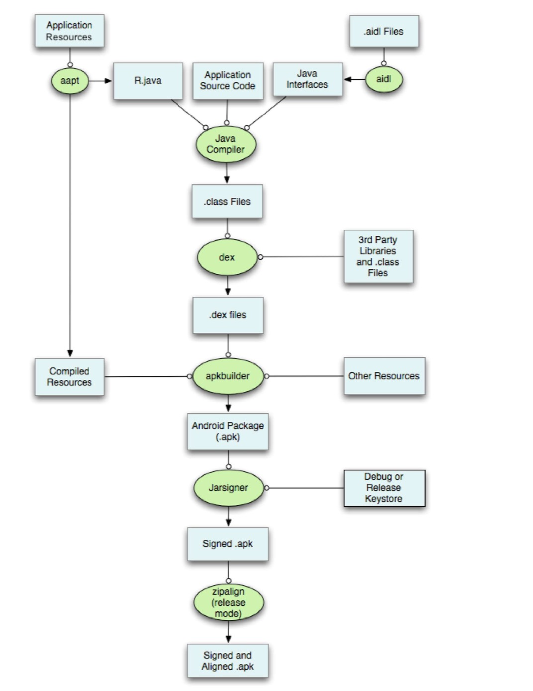
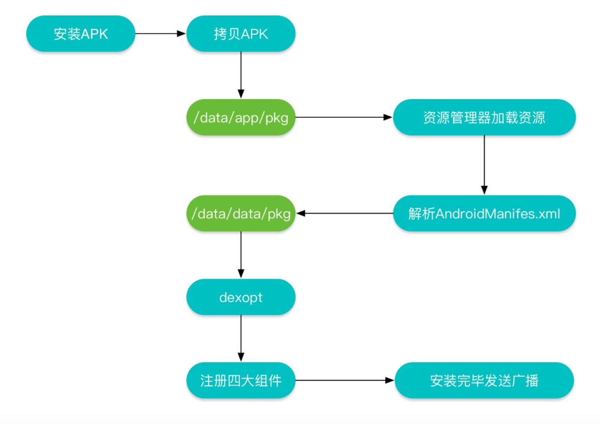

### APK的打包流程

Android的包文件APK分为两个部分：代码和资源，所以打包也分为资源打包和代码打包两部分。

APK整体打包流程如下图所示：

- 1、通过AAPT工具进行资源文件（包括AndroidManifest.xml、布局文件、各种xml资源等）的打包，生成R.java
- 2、通过AIDL工具处理AIDL文件，生成相应的Java文件
- 3、通过Javac工具编译项目源码，生成class文件
- 4、通过DX工具将所有的Class文件转换成DEX文件，该过程主要是完成Java字节码装换成Dalvik字节码，压缩常量池以及清除信息等工作
- 5、 通过ApkBuilder将资源文件、DEX文件打包生成APK文件
- 6、 利用KeyStore对生成的APK文件进行签名
- 7、 如果是正式版的APK，还会利用ZIPAlign工具进行对齐处理，对齐的过程就是将文件中所有的资源文件起始距离都偏移4字节的整数倍，这样通过内存映射访问APK文件的速度回更快

### APK安装过程

- 1、 复制APK到/data/app目录下，解压并扫描安装包。
- 2、 资源管理器解析APK文件
- 3、 解析AndroidManifest.xml文件，并在data/data目录下创建对应的应用数据目录
- 4、 然后对dex文件进行优化，并保存在dalivk-cache目录下
- 5、 将AndroidManifest.xml中解析出的四大组件信息注册到PackageMangerService中
- 6、 安装完成后，发送广播

### APK文件结构

参考内容：

[APK文件结构和安装过程](https://mp.weixin.qq.com/s?__biz=MzI3MDE0NzYwNA==&mid=2651433396&idx=1&sn=180d2285d5c1c61aeeed4462ae7d75a9&scene=23&srcid=0525qQiTtYdC1rllR0q0maOm#rd)