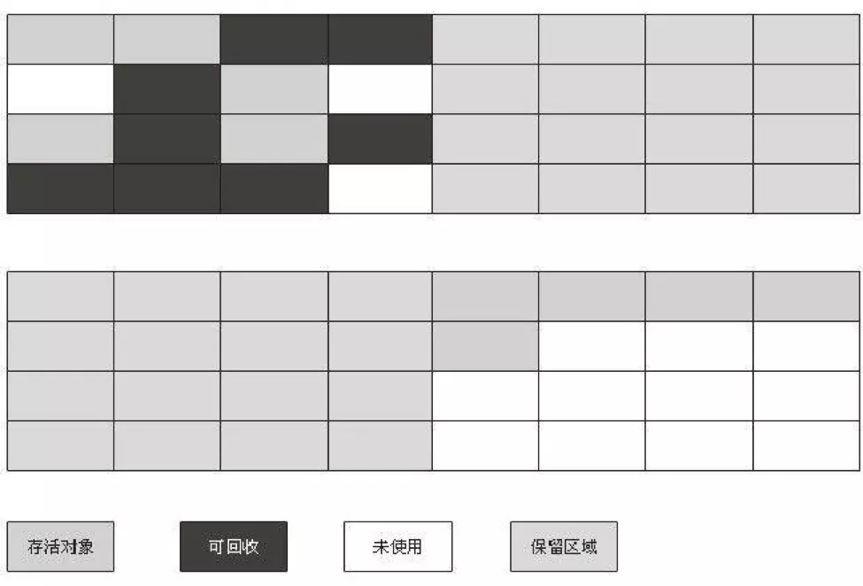
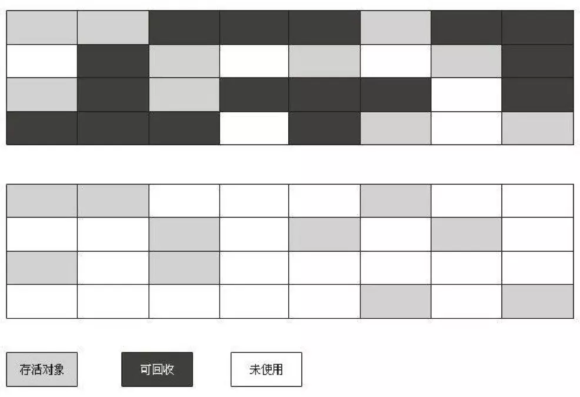
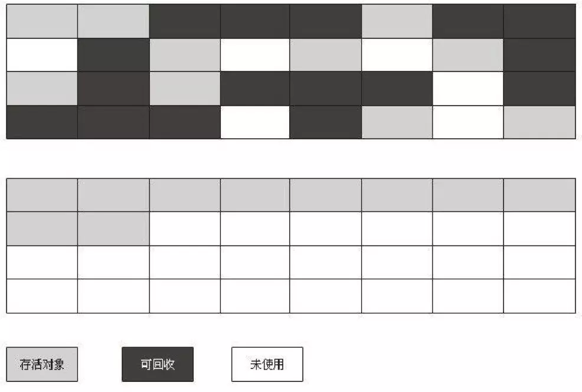
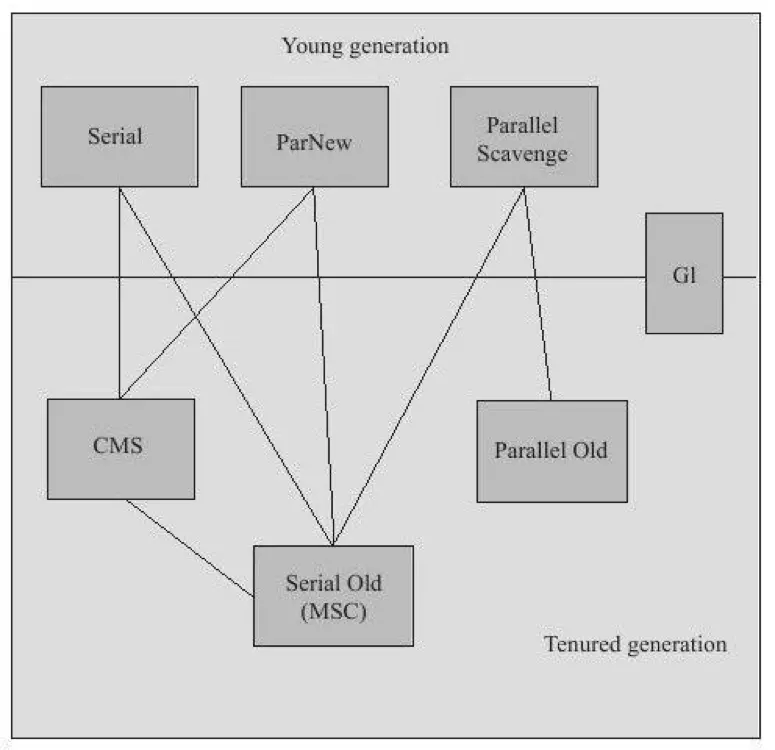
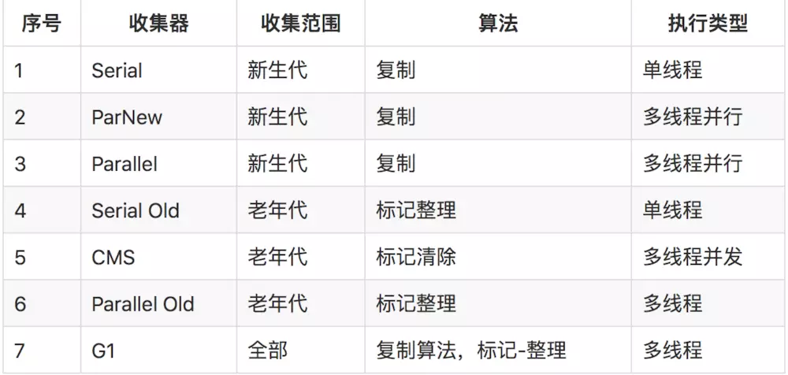

### 哪些内存需要回收
[Java的内存区域](./Java的内存区域.md)中介绍了Java内存运行时区域的各个部分，其中程序计数器、虚拟机栈、本地方法栈3个区域随线程而生，随线程而灭。

栈中的栈帧随着方法的进入和退出而有条不紊地执行值出栈和入栈的操作。每一个栈帧中分配多少内存基本上是在类结构确定下来就已知的，大体上认为这部分内存时编译器可知的。这部分内存在方法结束或者线程结束时就自动回收了。

而Java堆和方法区则不一样，一个接口中的多个实现类需要的内存可能不一样，一个方法中的多个分支需要的内存也可能不一样，只有在程序运行期间才能知道会创建哪些对象，这部分内存的分配和回收都是动态的，Java中GC关注的就是这部分内存。

### 内存什么时候回收
> 分为Java堆的内存回收和方法区的内存回收
#### Java堆的内存回收
Java堆中存放的几乎是所有对象的实例，GC回收这部分内存前，需要判断这些对象的存活状态。

##### 对象存活判定算法

> 概念：引用的四种类型
* 强引用（StrongReference）
  * 具有强引用的对象不会被GC；
  * 即便内存空间不足，JVM宁愿抛出OutOfMemoryError使程序异常终止，也不会随意回收具有强引用的对象。
* 软引用（SoftReference）
  * 只具有软引用的对象，会在内存空间不足的时候被GC，如果回收之后内存仍不足，才会抛出OOM异常；
  * 软引用常用于描述有用但并非必需的对象，比如实现内存敏感的高速缓存。
* 弱引用（WeakReference）
  * 只被弱引用关联的对象，无论当前内存是否足够都会被GC；
  * 强度比软引用更弱，常用于描述非必需对象。
* 虚引用（PhantomReference）
  * 仅持有虚引用的对象，在任何时候都可能被GC
  * 常用于跟踪对象被GC回收的活动；
  * 必须和引用队列 （ReferenceQueue）联合使用，当垃圾回收器准备回收一个对象时，如果发现它还有虚引用，就会在回收对象的内存之前，把这个虚引用加入到与之关联的引用队列中。

##### a. 引用计数法
定义：给对象中添加一个引用计数器，每当有一个地方引用它时，计数器值就加1；当引用失效时，计数器值就减1；任何时刻计数器为0的对象就是不可能再被使用的。

> 然而在主流的Java虚拟机里未选用引用计数算法来管理内存，主要原因是它难以解决对象之间相互循环引用的问题，所以出现了另一种对象存活判定算法。

##### b.可达性分析法
定义：通过一系列被称为『GC Roots』的对象作为起始点，从这些节点开始向下搜索，搜索所走过的路径称为引用链，当一个对象到GC Roots没有任何引用链相连时，则证明此对象是不可用的。

> 可作为GC Roots的对象
> * 虚拟机栈中引用的对象，只要是指栈中的``本地变量``
> * 本地方法栈中的``Native方法``引用的对象
> * 方法区中``类静态属性``引用的对象
> * 方法区中``常量``引用的对象

需要注意的是，在可达性分析算法中被判定不可达的对象还未真的判『死刑』，至少要经历两次标记过程：判断对象是否有必要执行finalize()方法；若被判定为有必要执行finalize()方法，之后还会对对象再进行一次筛选，如果对象能在finalize()中重新与引用链上的任何一个对象建立关联，将被移除出“即将回收”的集合。

#### 方法区的回收
方法区在HotSpot虚拟机中被称为永久代。
永久代的垃圾收集主要回收两部分内存：废弃常量和无用的类。
##### a.废弃常量的回收
与回收Java堆中的对象的GC很类似，即在任何地方都未被引用的常量会被GC。

##### b.无用的类回收
无用的类需满足一下三个条件才会被GC：
* 该类所有的实例都已被回收，即Java堆中不存在该类的任何实例；
* 加载该类的ClassLoader已经被回收；
* 该类对应的java.lang.Class对象没在任何地方被引用，即无法在任何地方通过反射访问该类的方法。

### 内存如何回收
如何回收也就是谈到垃圾回收算法：

#### 垃圾收集算法

##### 分代收集算法
* 根据对象存活周期的不同，将Java堆划分为新生代和老年代，并根据各个年代的特点采用最适当的收集算法。
  * 新生代：大批对象死去，只有少量存活。使用``复制算法``,只需要复制少量存活对象即可。
  * 老年代：对象存活率高。使用``标记-清除算法``和``标记-整理算法``，只需要标记较少的回收对象即可。

* 是当前商业虚拟机都采用的一种算法。

> 接下来依次介绍以上提及的三种算法。

##### 复制算法
* 把可用内存容量划分为大小相等的两块，每次使用其中的一块。当这一块的内存用尽后，把还存活着的对象``复制``到另外一块上面，再将这一块内存空间一次清理掉。
* 优点：每次都是对整个半区进行内存回收，无需考虑内存碎片等复杂情况，只要移动堆顶指针，按顺序分配内存即可，实现简单，运行高效。
* 缺点：每次可使用的内存缩小为原来的一半，内存使用率低。

> 有研究表明新生代中的对象98%是朝生夕死的，因此没必要按照1:1来划分内存空间，而是分为一块较大的Eden空间和两块较小的Survivor空间，在HotSpot虚拟机中默认比例为8:1:1。每次使用Eden和一块Survivor，回收时将这两块中存活着的对象一次性地复制到另外一块Survivor上，再做清理。可见只有10%的内存会被“浪费”，倘若Survivor空间不足还需要依赖其他内存（老年代）进行分配担保。

##### 标记-清除算法
* 首先是``标记``出所有需要回收的对象，然后统一``清除``所有被标记的对象。
* 是最基础的收集算法。
* 缺点：``标记``和``清除``的效率不高；空间碎片太多，``标记-清除``之后产生大量不连续的内存碎片，可能会导致后续需要分配较大对象时，因无法找到足够的连续内存而提前触发另一次GC，影响系统性能.

##### 标记-整理算法
* 首先``标记``出所有需要回收的对象，然后进行``整理``，使得存活的对象都向一端移动，最后直接清理掉端边边界以外的内存。
* 有点：即没有浪费50%的内存空间，又不存在空间碎片问题，性价比较高。
* 一般情况下，老年代会选择标记-整理算法。

#### HotSpot算法实现&垃圾回收器
> 接下来介绍如何在HotSpot虚拟机上实现对象存活判定算法和垃圾手机算法，并保证虚拟机高效执行。

##### 枚举根节点
主流虚拟机采用的都是``准确式GC``,在执行系统停顿之后无需执行上下文和全局的引用位置，而是通过一些办法直接获取到存放对象的地方，在HotSpot中是通过一组称为``OopMap``的数据结构来实现的，完成类加载后会计算出对象内什么偏移量上是什么类型的数据计算出来，在JIT编译过程中，也会在``特定的位置``记录下栈和寄存器中的哪些位置是引用。这样GC在扫描时就可直接得知这些信息，并快速准确地完成GC Roots的枚举。

##### 安全点
上述“特定的位置”被称为安全点，即程序执行时并非在所有地方都停顿执行GC，只在到达安全点时才暂停，降低GC的成本。

* 安全点选取的标准：可让程序长期执行的地方，如方法调用，循环跳转、异常跳转等具有指令序列复用的特征。
* 使所有线程在最近的安全点上再停顿的方案：
  * 抢先式中断：无需代码主动配合，在发生GC时把所有的线程全部中断，若线程中断处不在安全点上就恢复线程，让它“跑”到安全点上。现在几乎没有虚拟机采用抢先式中断来暂停线程从而响应GC事件。
  * 主动式中断：在GC要中断线程时不直接对线程操作，而是设置一个中断标志，让各个线程在执行时主动轮询它，当中断标志为真时就自己主动中断挂起。

##### 安全区域
安全点机制只能保证程序执行时，在不太长的时间内遇到可进入GC的安全点，但在程序不执行时（如线程处于Sleep或Blocked状态）线程无法响应JVM的中断请求，此时就需要安全区域来解决。

* 安全区域：引用关系不会发生变化的一段代码片段，在安全区域中的任意地方开始GC都是安全的，可看做是扩展的安全点。
* 执行过程：当线程执行到安全区域中的代码时就标识一下，如果这时JVM要发起GC就不用管被标识的线程；在线程要离开安全区域时检查系统是否已经完成了根节点枚举，若完成则线程可以继续执行，否则等待直到收到可以安全离开安全区域的信号为止。

> 到此只是简单介绍了HotSpot如何发起内存回收，而具体的回收动作是由虚拟机所采用的GC收集器决定的，通常虚拟机中往往不止有一种GC收集器，下图展示的是HotSpot虚拟机中存在的七种作用于不同分代（新生代、老年代）的收集器，其中被连线的两个收集器表示可以搭配使用。

> 并行(Parallel)：多条垃圾收集线程并行工作，而用户线程仍处于等待状态。

> 并发(Concurrent)：垃圾收集线程与用户线程一段时间内同时工作，用户程序在继续运行，而垃圾收集程序运行于另一个CPU上。

#### 内存分配和回收策略

> 对象的内存分配广义上是指在堆上分配，主要是在新生代的Eden区上，如果启动了TLAB，将按线程优先在TLAB上分配，少数情况下也可能会分配在老年代中。分配细节还是取决于所使用的GC收集器组合以及虚拟机中与内存相关的参数的设置。以下介绍几条普遍的内存分配规则。

* ``对象有线在Eden分配``：大多数情况下对象在新生代Eden区中分配，当Eden区没有足够空间进行分配时虚拟机将发起一次Minor GC。

> 新生代GC（Minor GC）：发生在新生代的垃圾收集动作。较频繁、回收速度也较快。

> 老年代GC（Major GC/Full GC）：发生在老年代的垃圾收集动作。出现Major GC经常会伴随至少一次的Minor GC。速度一般比Minor GC慢10倍以上。

* ``大对象直接进入老年代``：对于需要大量连续内存空间的Java对象（如很长的字符串以及数组），如果大于虚拟机设定的-XX：PretenureSizeThreshold参数值将直接在老年代分配。这样做的目的是避免在Eden区及两个Survivor区之间发生大量的内存复制。

* ``长期存活的对象将进入老年代``：虚拟机会给每个对象定义一个年龄计数器，当对象在Eden出生并经过第一次Minor GC后仍存活且能被Survivor容纳的话，将被移动到Survivor空间中并将对象年龄设为1；当对象在Survivor区中每“熬过”一次Minor GC年龄就+1，直至增加到一定程度（默认为15岁，可通过-XX： MaxTenuringThreshold设置）就会被晋升到老年代中。

* ``动态对象年龄判定``：为了能更好地适应不同程序的内存状况，虚拟机并不要求一定要达到-XX： MaxTenuringThreshold设置值才能晋升到老年代，当Survivor空间中相同年龄所有对象大小的总和大于Survivor空间的一半，那么年龄大于或等于该年龄的对象可以直接进入老年代。

* ``空间分配担保``：在发生Minor GC之前虚拟机会先检查老年代最大可用的连续空间是否大于新生代所有对象总空间，若是，说明可确保Minor GC是安全的，反之虚拟机会查看-XX：HandlePromotionFailure设置值是否允许担保失败；若允许，会继续检查老年代最大可用的连续空间是否大于历次晋升到老年代对象的平均大小；若大于，将尝试进行一次Minor GC，若小于或者不允许担保失败，将改为进行一次Full GC。

> 解释：当大量对象在MinorGC后仍然存活的情况时，需要借助老年代进行分配担保，把Survivor无法容纳的对象直接进入老年代，但前提是老年代本身还有容纳这些对象的剩余空间，由于在完成内存回收之前无法预知实际存活对象，只好取之前每次回收晋升到老年代对象容量的平均大小值作为经验值，与老年代的剩余空间进行比较，从而决定是否进行Full GC来让老年代腾出更多空间。