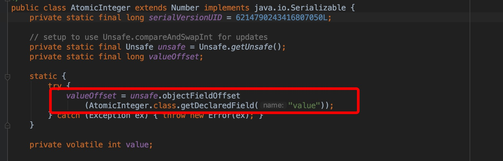

什么是CAS? 即比较并替换，实现并发算法时常用到的一种技术。CAS操作包含三个操作数——内存位置、预期原值及新值。执行CAS操作的时候，将内存位置的值与预期原值比较，如果相匹配，那么处理器会自动将该位置值更新为新值，否则，处理器不做任何操作。我们都知道，CAS是一条CPU的原子指令（cmpxchg指令），不会造成所谓的数据不一致问题，Unsafe提供的CAS方法（如compareAndSwapXXX）底层实现即为CPU指令cmpxchg。

AtomicInteger的实现中，静态字段valueOffset即为字段value的内存偏移地址，valueOffset的值在AtomicInteger初始化时，在静态代码块中通过Unsafe的objectFieldOffset方法获取。在AtomicInteger中提供的线程安全方法中，通过字段valueOffset的值可以定位到AtomicInteger对象中value的内存地址，从而可以根据CAS实现对value字段的原子操作。



AtomicInteger中的compareAndSet方法：

```
      /**
     * Atomically sets the value to the given updated value
     * if the current value {@code ==} the expected value.
     *
     * @param expect the expected value
     * @param update the new value
     * @return {@code true} if successful. False return indicates that
     * the actual value was not equal to the expected value.
     */
    public final boolean compareAndSet(int expect, int update) {
        return unsafe.compareAndSwapInt(this, valueOffset, expect, update);
    }

```

compareAndSet其实调用的是UnSafe.java中的compareAndSwapInt

```
    /**
        * Atomically update Java variable to <tt>x</tt> if it is currently
        * holding <tt>expected</tt>.
        * @return <tt>true</tt> if successful
        */
    public final native boolean compareAndSwapInt(Object o, long offset,
                                                     int expected,
                                                      int x);
```

UnSafe.java对应的cpp是UnSafe.cpp

```c++
UNSAFE_ENTRY(jboolean, Unsafe_CompareAndSwapInt(JNIEnv *env, jobject unsafe, jobject obj, jlong offset, jint e, jint x))
  UnsafeWrapper("Unsafe_CompareAndSwapInt");
  oop p = JNIHandles::resolve(obj);
  jint* addr = (jint *) index_oop_from_field_offset_long(p, offset);
  return (jint)(Atomic::cmpxchg(x, addr, e)) == e;
UNSAFE_END
```

可以看到UnSafe.cpp中最后调用的是cmpxchg这个CPU指令，这个是一个原子操作。由于是CPU级别的指令，其开销比需要操作系统参与的锁的开销小。

ABA问题是什么

ABA 问题，正常情况下不需要关注，如果只关心结果的情况下，但是某些情况下，比如交易，资金流动这种情况下，需要有资金流转的记录。

如何解决ABA问题。