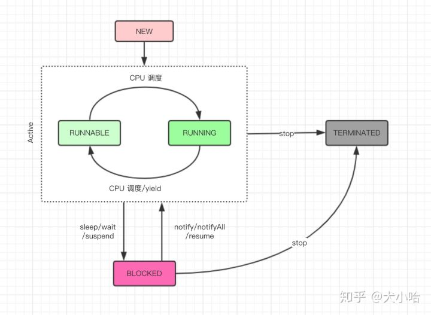

每一个线程都有自己的生命周期。

在解释线程的生命周期之前，请大家思考一个问题，线程在执行start方法后就代表线程已经开始执行了吗？

由上图所知，线程的生命周期大体可以分为5个主要的阶段：
- NEW
- RUNNABLE
- RUNNING
- BLOCKED
- TERMINATED

#### 线程的NEW状态
当我们使用关键字new创建一个Thread对象时，此时它并不处于执行状态，因为没有调用start方法启动该线程，那么线程的状态未NEW状态，准确地说，它只是Thread对象的状态，因为在没有start之前，该线程根本不存在，与你使用关键字new 创建一个普通的Java对象没有什么区别。

NEW状态通过start方法进入RUNNABLE状态。

#### 线程的RUNNABLE状态
线程对象进入RUNNABLE状态必须调用start方法，那么此时才是真正地在JVM进程中创建了一个线程，线程一经启动就可以立即得到执行嘛？答案是否定的，线程的运行与否和进程一样要听命于CPU的调度，那么我们把这个中间状态称为可执行状态（RUNNABLE），也就是说它具备执行的资格，但是并没有真正地执行气啦而是等待CPU的调度。

由于存在RUNNING状态，所依不会直接进入BLOCKED状态和TERMINATED状态，即使是在线程的执行逻辑中调用wait，sleep或者其他block的IO操作等，也必须先获得CPU的调度执行权才可以，严格来讲，RUNNABLE的线程只能意外终止或者进入RUNNING状态。
#### 线程的RUNNING状态
一旦CPU通过轮询或者其他方式从任务可执行队列中选中了线程，那么此时它才能真正地执行自己的逻辑代码，需要说的一点是一个正在RUNNING状态的线程试试上也是RUNNABLE的，但是反过来则不成立。

在该状态中，线程的专题可以发生如下的状态转换。
- 直接进入TERMINATED状态，比如调用JDK已经不推荐使用的stop方法或者判断某个逻辑标识
- 进入BLOCKED状态，比如调用了sleep，或者wait方法而进入了waitSet中。
- 进行某个阻塞的IO操作，比如因网络数据镀锌而进入了BLOCKED状态。
- 获取某个锁资源，从而加入到该锁的阻塞队列中而进入了BLOCKED状态。
- 由于CPU的调用器轮询使该线程放弃执行，进入RUNNALE状态。
- 线程主动调用yield方法，放弃CPU执行权，进入RUNNABLE状态。

#### 线程的BLOCKED状态
线程在BLOCKED状态中可以切换至如下几个状态。
- 直接进入TERMINATED状态，比如调用JDK已经不推荐使用的stop方法或者意外死亡（JVM crash）。
- 线程阻塞的操作结束，比如读取了想要的数组字节进入到RUNNABLE状态。
- 线程完成了指定时间的休眠，进入到了RUNNABLE状态。
- Wait中的线程被其他线程notify/notifyall唤醒，进入RUNNABLE状态。
- 线程获取到来了某个锁资源，进入RUNNABLE状态。
- 现在在阻塞过程中被打断，比如其他线程调用了interrupt方法，进入RUNNABLE状态。

#### 线程的TERMINATED状态
TERMINATED是一个线程的最终状态，在该状态中线程不会切换到其他任何状态，线程进入TERMINATED状态，意味着线程将不会切换到其他任何状态，线程进入TERMINATED状态，意味着该线程的生命周期都结束了，下列这些情况将会使线程进入TERMINATED状态。

- 线程运行正常结束，结束生命周期。
- 线程运行出错意外结束。
- JVM Crash，导致所有的线程都结束。
