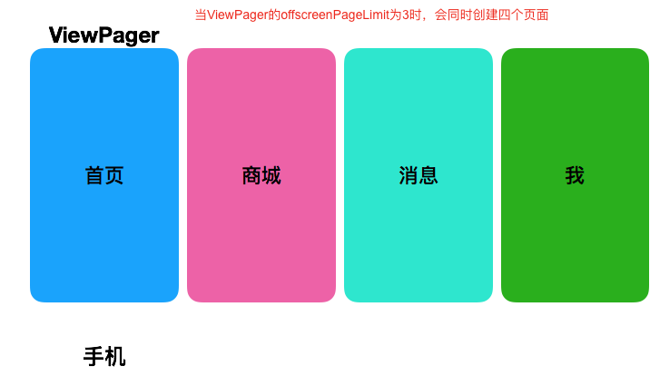

之前在做重构的时候，需要梳理首页的代码逻辑，在这个过程中我发现我们的 App 每次启动的时候都会默认加载所有的页面框架，除了首页之外，还包括【商城页】、【消息页】和【个人页】。

因为首页默认采用ViewPager作为容易来承载app的四个页面切换，当首页ViewPager的offsetScreenPageLimit为3时，会默认加载当前页面的后三个页面。



针对这种情况，考虑做延迟加载，于是把offsetScreenPageLimit设置为1。

当将offsetScreenPageLimit设置为1的时候，超过这个阈值的页面会被销毁。

于是重写了ViewPager中Adapter的页面的创建和销毁逻辑，利用Fragment的show/hide 来做特殊处理，保证已经创建过的页面不会重复创建。

```java
class IndexPagerAdapter @Inject constructor(private val fm: FragmentManager,
                                            @Named("IndexAdapterFragments") val fragments: ArrayList<Fragment>
) : FragmentPagerAdapter(fm) {

    override fun getCount(): Int = fragments.size
    override fun getItem(position: Int): Fragment = fragments[position]

    override fun instantiateItem(container: ViewGroup, position: Int): Any {
        val fragment = super.instantiateItem(container, position) as Fragment
        fm.beginTransaction().show(fragment).commitAllowingStateLoss()
        return fragment
    }

    override fun destroyItem(container: ViewGroup, position: Int, obj: Any) {
        fm.beginTransaction().hide(obj as Fragment).commitAllowingStateLoss()
    }

    override fun getItemPosition(item: Any): Int {
        return POSITION_UNCHANGED
    }
}

```


